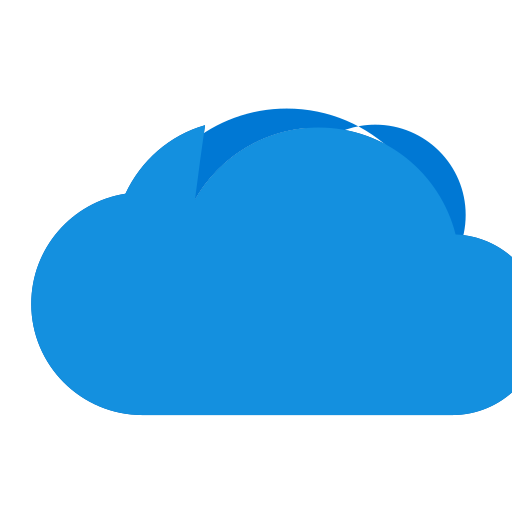

<div align="center">

[](https://github.com/airweave-ai/airweave/actions/workflows/ruff.yml)
[](https://github.com/airweave-ai/airweave/actions/workflows/eslint.yml)
[](https://discord.com/invite/484HY9Ehxt)

</div>


**Airweave** is an open-source tool that makes **any app searchable** for your agent by syncing your users' app data, APIs, databases, and websites into your graph and vector databases with minimal configuration.


<p align="center" style="padding-top: 4px; padding-bottom: 16px;">
  
  <em>Airweave demo - choose source, vector database, and sync.</em>
</p>


## Table of Contents

1. [Overview](#overview)
2. [Quick Start](#quick-start)
3. [Usage](#usage)
4. [Key Features](#key-features)
5. [Technology Stack](#technology-stack)
6. [Configuration](#configuration)
7. [Contributing](#contributing)
8. [Roadmap](#roadmap)
9. [License](#license)

---

## Overview

Airweave simplifies the process of making your data searchable. Whether you have structured or unstructured data, Airweave helps you break it into processable entities, store the data in graph and vector databases, and retrieve it via your own **agent** or any **search mechanism**.


## Quick Start

Below is a simple guide to get Airweave up and running locally. For more detailed instructions, refer to the [docs](https://docs.airweave.ai).


### Steps

1. **Clone the Repository**
   ```bash
   git clone https://github.com/airweave-ai/airweave.git
   cd airweave

3. **Build and Run**
   ```bash
   chmod +x start.sh
   ./start.sh
   ```

That's it!

You now have Airweave running locally. You can log in to the dashboard, add new sources, and configure your sync schedules.


## Usage

To use Airweave, you can either use the frontend or the API.


### Frontend
- Access the React UI at `http://localhost:8080`.
- Navigate to Sources to add new integrations.
- Set up or view your sync schedules under Schedules.
- Monitor sync jobs in Jobs.

### API Endpoints (FastAPI)
- **Swagger Documentation:** `http://localhost:8001/docs`
- **Get All Sources:** `GET /sources`
- **Connect a Source:** `POST /connections/{short_name}`


### Native Weaviate
Airweave uses a local Weaviate instance by default, you can access the Weaviate API at `http://localhost:8087`. This can be used for testing and development.

You can configure your own vector database in the app UI or via the API.

### Why Airweave?
- **Over 25 integrations and counting**: Airweave is your one-stop shop for building any application that requires semantic search.
- **Simplicity**: Minimal configuration needed to sync data from diverse sources (APIs, databases, and more).
- **Extensibility**: Easily add new integrations via `sources` , `destinations` and `embedders`.
- **Open-Core**: Core features are open source, ensuring transparency. Future commercial offerings will bring additional, advanced capabilities.
- **Async-First**: Built to handle large-scale data synchronization asynchronously (upcoming: managed Redis workers for production scale)

---

## Integrations - adding more every day!

<!-- START_APP_GRID -->

<p align="center">
  <div style="display: inline-block; text-align: center; padding: 4px;">
    
    
    
    
    <span style="width: 40px; display: inline-block; margin: 4px;"></span><span style="width: 40px; display: inline-block; margin: 4px;"></span><span style="width: 40px; display: inline-block; margin: 4px;"></span>
  </div>
</p>

<!-- END_APP_GRID -->


---

## Key Features
- **No code reqired, but extensible**: Users that prefer not to touch any code can make their app searchable in a few clicks
- **White-Labeled Multi-Tenant Support**: Ideal for SaaS builders, Airweave provides a streamlined OAuth2-based platform for syncing data across multiple tenants while maintaining privacy and security.
- **Entity Generators**: Each source (like a database, API, or file system) defines a `async def generate_entities()` that yields data in a consistent format. You can also define your own.
- **Automated Sync**: Schedule data synchronization or run on-demand sync jobs.
- **Versioning & Hashing**: Airweave detects changes in your data via hashing, updating only the modified entities in the vector store.
- **Multi-Source Support**: Plug in multiple data sources and unify them into a single queryable layer.
- **Scalable**: Deploy locally via Docker Compose for development (upcoming: deploy with Kubernetes for production scale)


## Technology Stack

- **Frontend**: [React](https://reactjs.org/) (JavaScript/TypeScript)
- **Backend**: [FastAPI](https://fastapi.tiangolo.com/) (Python)
- **Infrastructure**:
  - Local / Dev: [Docker Compose](https://docs.docker.com/compose/)
  - Production: (upcoming) [Kubernetes](https://kubernetes.io/)
- **Databases**:
  - [PostgreSQL](https://www.postgresql.org/) for relational data
  - Vector database (your choice, e.g. Chroma, Milvus, Pinecone, Qdrant, Weaviate, etc.)  + (upcoming batteries-included vector DB)
- **Asynchronous Tasks**: [ARQ](https://arq-docs.helpmanual.io/) Redis for background workers

---


## Bring your own database

You can configure Airweave to use your own PostgreSQL database to store sources, schedules, and metadata. Update the following variables in your `.env` file:

```env
POSTGRES_USER=<your-database-username>
POSTGRES_PASSWORD=<your-database-password>
POSTGRES_DB=<your-database-name>
POSTGRES_HOST=<your-database-host>
POSTGRES_PORT=<your-database-port>
```


## Contributing

We welcome all contributions! Whether you're fixing a bug, improving documentation, or adding a new feature:

Please follow the existing code style and conventions. See [CONTRIBUTING.md](https://github.com/airweave-ai/airweave/blob/main/README.md) for more details.

---

## Roadmap

- **Additional Integrations**: Expand entity generators for popular SaaS APIs and databases.
- **Redis & Worker Queues**: Improved background job processing and caching for large or frequent syncs.
- **Webhooks**: Trigger syncs on external events (e.g. new data in a database)
- **Kubernetes Support**: Offer easy Helm charts for production-scale deployments.
- **Commercial Offerings**: Enterprise features, extended metrics, and priority support.

---

## License

Airweave is released under an open-core model. The community edition is licensed under the [Apache 2.0 License](LICENSE). Additional modules (for enterprise or advanced features) may be licensed separately.

---

## Contact & Community
- **Discord**: Join our Discord channel [here](https://discord.com/invite/484HY9Ehxt) to get help or discuss features.
- **GitHub Issues**: Report bugs or request new features in GitHub Issues.
- **Twitter**: Follow @airweave_ai for updates.

That's it! We're looking forward to seeing what you build. If you have any questions, please don't hesitate to open an issue or reach out on Discord.
