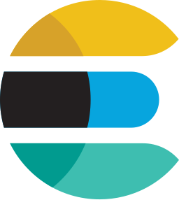

<div align="center">

<div align="center">

[](https://github.com/airweave-ai/airweave/actions/workflows/ruff.yml)
[](https://github.com/airweave-ai/airweave/actions/workflows/eslint.yml)
[](https://github.com/airweave-ai/airweave/actions/workflows/tests.yml)
[](https://codecov.io/gh/airweave-ai/airweave)
[](https://discord.com/invite/484HY9Ehxt)
<br>
<div style="padding-top: 16px;">
<a href="https://trendshift.io/repositories/13748" target="_blank"></a>&nbsp;&nbsp;<a href="https://www.ycombinator.com/launches/NX7-airweave-let-agents-search-any-app" target="_blank"></a>
</div>
</div>

### Make any app searchable for your AI agents

[**Start Now**](https://app.airweave.ai) &nbsp;&nbsp;&nbsp; [**Docs**](https://docs.airweave.ai) &nbsp;&nbsp;&nbsp; [**Discord**](https://discord.com/invite/484HY9Ehxt)

</div>

## What is Airweave?

Airweave is an open-source platform that connects to your apps, databases, and documents, transforming them into searchable knowledge bases accessible through REST APIs or MCP servers. Built for developers who need their AI agents to access and semantically search across multiple data sources seamlessly.

## Quick Start

### ☁️ **Cloud**
Go to **[app.airweave.ai](https://app.airweave.ai)**

### 🐳 **Self-Hosted**
```bash
git clone https://github.com/airweave-ai/airweave.git
cd airweave
./start.sh
```
**Access at http://localhost:8080**

## How it works

### 1️⃣ Create your collection

```python
from airweave import AirweaveSDK

client = AirweaveSDK(api_key="YOUR_API_KEY")

collection = client.collections.create_collection(
    name="My First Collection"
)
```

### 2️⃣ Add data source(s) to your collection

```python
stripe_connection = client.source_connections.create_source_connection(
    name="My Stripe Connection",
    short_name="stripe",
    collection=collection.readable_id,
    auth_fields={
        "api_key": "sk_test_your_stripe_key"
    },
    sync_immediately=True # Start syncing your data immediately
)
```

### 3️⃣ Search your collection

```python
results = client.collections.search_collection(
    readable_id=collection.readable_id,
    query="What are the main features?",
    response_type="completion"
)
```

<details>
<summary><b>📦 Node.js SDK</b></summary>

```typescript
import { AirweaveSDKClient, ResponseType } from "@airweave/sdk";

const client = new AirweaveSDKClient({ apiKey: "YOUR_API_KEY" });
```
</details>

<details>
<summary><b>🤖 MCP Server</b></summary>
```json
{
  "mcpServers": {
    "airweave-search": {
      "command": "npx",
      "args": ["-y", "airweave-mcp-search"],
      "env": {
        "AIRWEAVE_API_KEY": "your-api-key",
        "AIRWEAVE_COLLECTION": "your-collection-id"
      }
    }
  }
}
```
</details>

<details>
<summary><b>🌐 REST API</b></summary>
```bash
# Create collection
curl -X POST 'https://api.airweave.ai/collections' \
  -H 'x-api-key: YOUR_API_KEY' \
  -H 'Content-Type: application/json' \
  -d '{"name": "My First Collection"}'
```
</details>

## 🔌 26 Supported Integrations

<div align="center">
  
  
  
  
  
  <br>
  
  
  
  
  
  <br>
  
  
  
  
  
  <br>
  
  
  
  
  
  <br>
  
  
  
  
  
  <br>

  <br><br>
  **Need another integration?** [Let us know](https://github.com/airweave-ai/airweave/issues) or [build your own](https://docs.airweave.ai/add-new-source)!
</div>

## 🤝 Join the Community

We're building Airweave in the open and would love your help!

- **[Discord](https://discord.com/invite/484HY9Ehxt)** - Get help, share ideas, meet other developers
- **[GitHub Issues](https://github.com/airweave-ai/airweave/issues)** - Report bugs, request features
- **[Contributing Guide](CONTRIBUTING.md)** - Submit PRs, add connectors, improve docs

### Ways to Contribute
- 🔌 Add new connectors
- 📖 Improve documentation
- 🐛 Report and fix bugs
- 💡 Suggest features
- ⭐ Star us on GitHub!

## 📚 Resources

- **[Documentation](https://docs.airweave.ai)** - Complete guides and API reference
- **[Quickstart Tutorial](https://docs.airweave.ai/quickstart)** - Detailed walkthrough
- **[API Reference](https://docs.airweave.ai/api-reference)** - Full API documentation
- **[MCP Setup](https://docs.airweave.ai/mcp-server)** - Connect to Claude and Cursor

## 📄 License

Airweave is open source under the [MIT License](LICENSE).

---

<div align="center">

Built with ❤️ by the [Airweave team](https://airweave.ai) and contributors worldwide

**[Get Started →](https://app.airweave.ai)**

</div>
