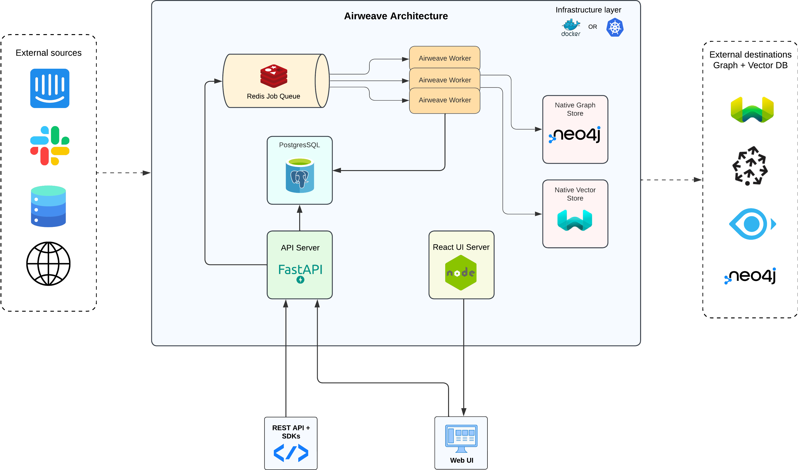

  Airweave is built as a modern, distributed system that makes your data searchable and accessible. This guide explains how our architecture works and how different components interact with each other.

<Note>
  We're here to help! If you have any questions or feedback, please [contact us](mailto:support@airweave.ai).
</Note>

<Frame background="subtle" caption="Airweave Architecture">
  
</Frame>

## How Airweave Works

### API and Data Processing
At the core of Airweave is our FastAPI server, which handles all API requests and coordinates system operations. We provide both [REST APIs](/api-reference) and dedicated [SDKs](/api-reference)/, making it easy to integrate Airweave into your existing agent stack.

When data enters the system, it flows through several stages:

1. The API server receives and validates the incoming request
2. Tasks are distributed to our worker cluster via Redis job queues
3. Workers process the data, generating embeddings and mapping relationships
4. Processed data is stored in specialized databases optimized for different query patterns - these can be the stores or destinations you've connected to Airweave.

### Data Architecture

**Neo4j**: Acts as our native graph store, managing the relationships between different pieces of information. This enables powerful graph-based queries and knowledge mapping.

**Weaviate**: We run a self-hosted instance of Weaviate to handle similarity search by managing vector embeddings, allowing for semantic search and content recommendations.

**PostgreSQL**: Serves as our primary database, handling user data, configurations, entity hashes and metadata. This does not host the actual entities, but rather the metadata to track the entities. Generally, you'll not need to interact with this database directly.

**Redis**: Acts as our job queue, distributing tasks to workers and handling task coordination, which isn't exposed to developers directly.

### Processing and Scalability
Airweave uses a distributed worker system with ARQ to handle resource-intensive tasks. These workers communicate with our job queue (powered by Redis) to process tasks like:

- Data ingestion and transformation
- Vector embedding generation
- Graph relationship mapping
- Background task execution

This architecture allows for horizontal scaling (edit in docker-compose.yml or Helm Chart) - you can add more workers as your processing needs grow.

## Deployment Options
Airweave is designed to be cloud-agnostic and can be deployed in several ways:

- As Docker containers for simple deployments for small projects
- On-premises in your own infrastructure, using Kubernetes
- Through our managed offering (coming soon)
- Through major cloud providers like AWS, GCP and Azure (also coming soon!)

<Note>
  While this architecture might seem complex, we've designed it to be simple to deploy and maintain. Most components are automatically managed, letting you focus on using the platform rather than maintaining it.
</Note>
