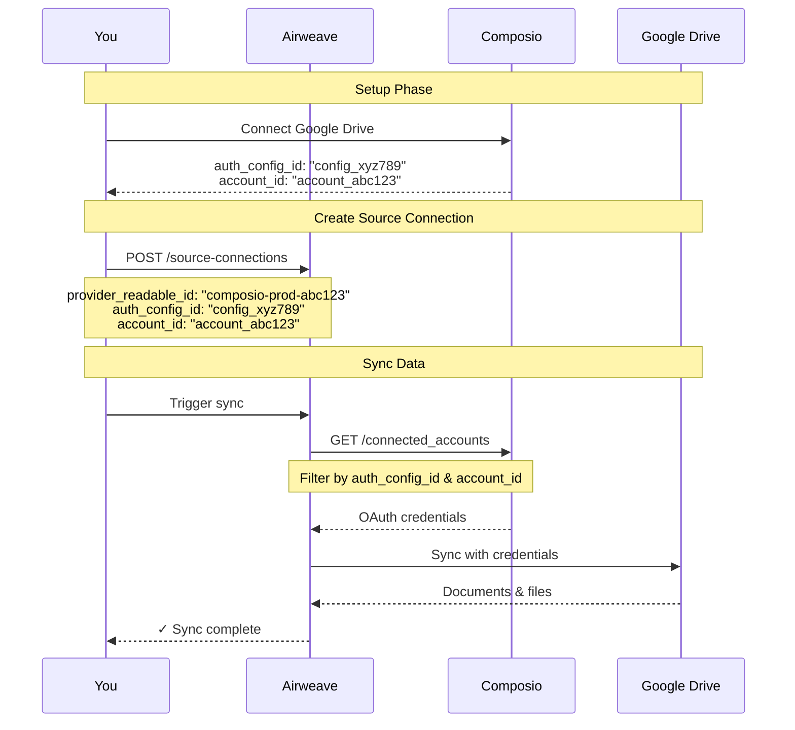

<div style={{ textAlign: 'center', margin: '2rem 0' }}>
  <picture>
    <source media="(prefers-color-scheme: dark)" srcSet="/docs/assets/images/auth-providers/composio-dark.svg" />
    <source media="(prefers-color-scheme: light)" srcSet="/docs/assets/images/auth-providers/composio-light.svg" />
    
  </picture>
</div>

## Overview

Composio enables Airweave to access credentials from integrated applications. When your users connect their accounts through Composio, Airweave can automatically retrieve those credentials for data synchronization.

## Prerequisites

- A Composio account with API access
- Your Composio API key
- Connected user accounts in Composio for the sources you want to sync

## Setup Guide

<Steps>

  <Step title="Get your Composio API Key" toc={true}>
    1. Log in to your [Composio dashboard](https://platform.composio.dev) and navigate to your Project.
    2. Go to your Project settings.
    3. Copy your API key from the Project API Keys.

     <video
      src="./composio_api_key.mp4"
      controls
      loop
      autoplay
      muted
      playsinline
      style={{ aspectRatio: '16 / 9', width: '100%' }}
    >
      Your browser does not support the video tag.
    </video>

  </Step>


  <Step title="Connect Composio to Airweave" toc={true}>
   1. Go to [Airweave Auth Providers](https://app.airweave.ai/auth-providers)
2. Click "Connect" next to Composio
3. Enter your API key
4. Provide a readable name for this connection
5. Click "Save"
  </Step>


<Step title="Find your connection details" toc={true}>
    To create source connections, you'll need two identifiers from Composio:

1. `auth_config_id`: Navigate to your Auth Configs page
2. `account_id`: Click on an auth config to see its connected accounts

<Callout type="info">
**Tip**: In Composio, one auth config can have multiple connected accounts, allowing you to manage different user connections under the same integration.
</Callout>

</Step>

<Step title="Create Source Connections" toc={true}>
    Now you can create source connections that automatically retrieve credentials from Composio:

<CodeBlocks>
```python title="Python"
from airweave import AirweaveSDK

client = AirweaveSDK(api_key="YOUR_API_KEY")

# Create a Google Drive connection using Composio credentials
source_connection = client.source_connections.create(
    name="Sales Team Google Drive",
    short_name="google_drive",
    authentication={
        "provider_readable_id": "my-composio-connection-abc123",  # Your Composio auth provider id
        "provider_config": {
            "auth_config_id": "config_xyz789",  # From Composio dashboard
            "account_id": "account_abc123"      # From Composio dashboard
        }
    }
)

print(f"Created: {source_connection.name}")
```

```typescript title="TypeScript"
import { AirweaveSDKClient } from "@airweave/sdk";

const client = new AirweaveSDKClient({
  apiKey: "YOUR_API_KEY"
});

// Create a Google Drive connection using Composio credentials
const sourceConnection = await client.sourceConnections.create({
  name: "Sales Team Google Drive",
  shortName: "google_drive",
  authentication: {
    providerReadableId: "my-composio-connection-abc123",  // Your Composio connection ID
    providerConfig: {
      authConfigId: "config_xyz789",  // From Composio dashboard
      accountId: "account_abc123"     // From Composio dashboard
    }
  }
});

console.log(`Created: ${sourceConnection.name}`);
```

```bash title="cURL"
curl -X POST 'https://app.airweave.ai/source-connections' \
  -H 'Authorization: Bearer YOUR_API_KEY' \
  -H 'Content-Type: application/json' \
  -d '{
  "name": "Sales Team Google Drive",
  "short_name": "google_drive",
  "authentication": {
    "provider_readable_id": "my-composio-connection-abc123",
    "provider_config": {
      "auth_config_id": "config_xyz789",
      "account_id": "account_abc123"
    }
  }
}'
```

<Callout type="warning">
**Note**: API Validation

The API now performs validation on auth provider source connections:

1. **Provider Existence**: 404 error if the specified `provider_readable_id` doesn't exist
2. **Source Compatibility**: 400 error if the provider doesn't support the specified source

**Example error response when provider doesn't support a source:**
```json
{
  "detail": "Source 'github' does not support 'composio' as an auth provider. Supported providers: []"
}
```
</Callout>
</CodeBlocks>
</Step>
</Steps>

## How It Works



## Field Mappings

Some sources use different field names between Airweave and Composio:

| Airweave Field | Composio Field |
|----------------|----------------|
| `api_key` | `generic_api_key` |
| `google_drive` | `googledrive` |
| `google_calendar` | `googlecalendar` |
| `outlook_mail` | `outlook` |
| `onedrive` | `one_drive` |

These mappings are handled automatically by Airweave.

## Troubleshooting

#### `No matching connection found`
- Verify the `auth_config_id` and `account_id` are correct
- Ensure the account is connected in Composio
- Check that the integration type matches (e.g., `google_drive` vs `googledrive`)

#### `Missing required auth fields`
- The source may require additional fields not available in Composio
- Check the field mappings section above
- Contact support if a mapping is missing

#### `Authentication failed`
- Verify your Composio API key is valid
- Check if the user's connection in Composio is still active
- Ensure the connected account has the necessary permissions

## API Reference

For full API details, see the [Source Connections API reference](/api-reference/source-connections/create-source-connections-post).
