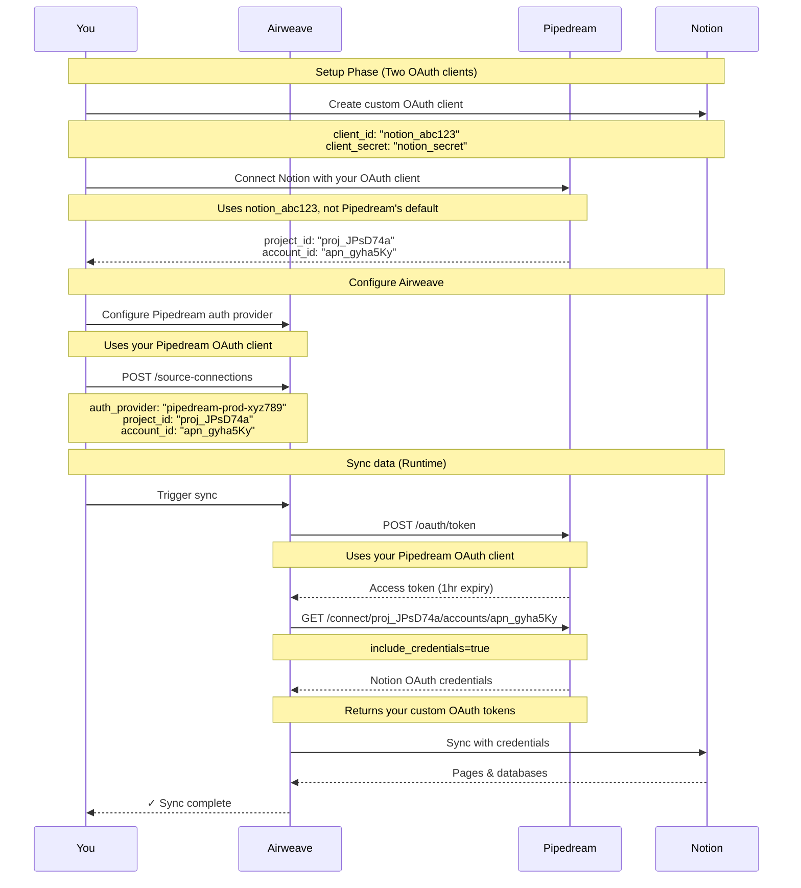

<div style={{ textAlign: 'center', margin: '2rem 0' }}>
  
</div>

## Overview

Pipedream enables workflow automation with 2,000+ integrated apps. Airweave can leverage your existing Pipedream connections to sync data without requiring users to authenticate again.

This integration involves two separate OAuth clients:

1. **Pipedream OAuth client**: Allows Airweave to access Pipedream's API
2. **Source app OAuth clients**: Custom OAuth clients you create for each source app (Notion, Slack, etc.)

<Callout type="warning">
**Important**: Pipedream only exposes credentials for accounts created with your own custom OAuth clients. Default Pipedream OAuth connections cannot be used with Airweave.
</Callout>

## Prerequisites

### For Pipedream API access:
- A Pipedream account with API access
- Pipedream OAuth client credentials (for Airweave to Pipedream authentication)

### For source app access:
- Custom OAuth clients created in each source app (Notion, Slack, Google Drive, etc.)
- Source app accounts connected to Pipedream using your custom OAuth clients
- Not accounts connected using Pipedream's default OAuth implementations

## Setup Guide

### Step 1: Set up Pipedream OAuth client

First, configure the OAuth client that allows Airweave to access Pipedream's API:

1. Log in to [Pipedream](https://pipedream.com)
2. Navigate to your project settings
3. Create a new OAuth client for Airweave integration
4. Configure redirect URIs if required
5. Save your `client_id` and `client_secret`

<Callout type="info">
**Purpose**: This OAuth client enables Airweave to authenticate with Pipedream's API to retrieve your connected account credentials.
</Callout>

### Step 2: Connect Pipedream to Airweave

1. Go to [Airweave Auth Providers](https://app.airweave.ai/auth-providers)
2. Click "Connect" next to Pipedream
3. Enter your Pipedream OAuth client credentials:
   - Client ID (from Step 1)
   - Client Secret (from Step 1)
4. Provide a readable name for this connection
5. Click "Save"

### Step 3: Create custom OAuth clients for source apps

For each source app you want to sync (Notion, Slack, etc.), you must create custom OAuth clients:

#### For Notion:
1. Go to [Notion Developers](https://developers.notion.com)
2. Create a new integration
3. Configure OAuth settings with your redirect URIs
4. Save the `client_id` and `client_secret`

#### For Slack:
1. Go to [Slack API](https://api.slack.com/apps)
2. Create a new app
3. Configure OAuth & Permissions
4. Save the `client_id` and `client_secret`

#### For other apps:
Follow similar steps for Google Drive, GitHub, or other source integrations.

<Callout type="warning">
**Important**: You must use these custom OAuth clients when connecting accounts in Pipedream. Do not use Pipedream's built-in OAuth options.
</Callout>

### Step 4: Connect source apps in Pipedream using custom OAuth

1. In Pipedream, go to your project's connections
2. For each source app (Notion, Slack, etc.):
   - Choose "Custom OAuth" option
   - Enter your custom OAuth client credentials from Step 3
   - Complete the OAuth flow to connect your account
3. Note the `account_id` for each connection (format: `apn_xxxxx`)

### Step 5: Find your connection details

To create source connections, you'll need these identifiers:

1. **project_id**: Found in the URL when viewing your project (e.g., `proj_JPsD74a`)
2. **account_id**: Retrieved via Pipedream API:

```bash
curl -X GET "https://api.pipedream.com/v1/connect/{project_id}/accounts?include_credentials=true" \
  -H "Authorization: Bearer YOUR_ACCESS_TOKEN"
```

The response will include account IDs like `apn_gyha5Ky`.

### Step 6: Create source connections

Create source connections that automatically retrieve credentials from Pipedream:

<CodeBlocks>
```python title="Python"
from airweave import AirweaveSDK

client = AirweaveSDK(api_key="YOUR_API_KEY")

# Create a Notion connection using Pipedream credentials
source_connection = client.source_connections.create_source_connection(
    name="Company Notion Workspace",
    short_name="notion",
    auth_provider="my-pipedream-connection-xyz789",  # Your Pipedream connection ID
    auth_provider_config={
        "project_id": "proj_JPsD74a",      # From Pipedream
        "account_id": "apn_gyha5Ky",       # From Pipedream API
        "environment": "production",        # Optional, defaults to "production"
        "external_user_id": "user123"      # Optional, for user mapping
    }
)

print(f"Created: {source_connection.name}")
```

```typescript title="TypeScript"
import { AirweaveSDKClient } from "@airweave/sdk";

const client = new AirweaveSDKClient({
  apiKey: "YOUR_API_KEY"
});

// Create a Notion connection using Pipedream credentials
const sourceConnection = await client.sourceConnections.createSourceConnection({
  name: "Company Notion Workspace",
  shortName: "notion",
  authProvider: "my-pipedream-connection-xyz789",  // Your Pipedream connection ID
  authProviderConfig: {
    project_id: "proj_JPsD74a",      // From Pipedream
    account_id: "apn_gyha5Ky",       // From Pipedream API
    environment: "production",      // Optional, defaults to "production"
    external_user_id: "user123"      // Optional, for user mapping
  }
});

console.log(`Created: ${sourceConnection.name}`);
```

```bash title="cURL"
curl -X POST 'https://app.airweave.ai/api/v1/source-connections' \
  -H 'Authorization: Bearer YOUR_API_KEY' \
  -H 'Content-Type: application/json' \
  -d '{
  "name": "Company Notion Workspace",
  "short_name": "notion",
  "auth_provider": "my-pipedream-connection-xyz789",
  "auth_provider_config": {
    "project_id": "proj_JPsD74a",
    "account_id": "apn_gyha5Ky",
    "environment": "production",
    "external_user_id": "user123"
  }
}'
```
</CodeBlocks>


## How It Works

The integration uses two distinct OAuth flows:

### OAuth flow overview

1. **Airweave to Pipedream**: Uses your Pipedream OAuth client for API access
2. **Pipedream to source apps**: Uses your custom OAuth clients for each source app



## Field Mappings

Pipedream uses different field names for some credentials:

| Airweave Field | Pipedream Field |
|----------------|-----------------|
| `access_token` | `oauth_access_token` |
| `refresh_token` | `oauth_refresh_token` |
| `client_id` | `oauth_client_id` |
| `client_secret` | `oauth_client_secret` |
| `api_key` | `api_key` |

These mappings are handled automatically.

## Token Management

Pipedream OAuth tokens have specific characteristics:

- **Expiry**: Access tokens expire after 3600 seconds (1 hour)
- **Auto-refresh**: Airweave refreshes tokens 5 minutes before expiry
- **Concurrency**: Token refresh is thread-safe with async locks
- **Grant Type**: Uses `client_credentials` flow

## Troubleshooting

### "Credentials not available"
```
Detail: Credentials not available. Pipedream only exposes credentials for
accounts created with custom OAuth clients, not default Pipedream OAuth.
```
**Root cause**: The account was connected using Pipedream's built-in OAuth client instead of your custom OAuth client.

**Solution**:
1. Disconnect the account in Pipedream
2. Reconnect using "Custom OAuth" option with your own OAuth client credentials
3. Ensure you're using the OAuth client you created in the source app (e.g., Notion Developer Portal)

### "Account app mismatch"
```
Detail: Account apn_xxx is not for app 'notion'
```
**Solution**: Verify the `account_id` corresponds to the correct integration type and was created with the right custom OAuth client.

### "Failed to refresh token" (Airweave to Pipedream)
This affects the connection between Airweave and Pipedream's API:
- Check if your Pipedream OAuth client credentials are valid
- Ensure your Pipedream OAuth client is active
- Verify network connectivity to Pipedream API

### "Failed to refresh token" (source app authentication)
This affects the source app tokens retrieved from Pipedream:
- Verify your source app OAuth client (e.g., Notion, Slack) is still active
- Check if the source app tokens have been revoked
- Ensure the source app OAuth client has required permissions

### "Missing required auth fields"
- The integration may require fields not provided by your custom OAuth implementation
- Check the field mappings table above
- Verify the source app OAuth client has all required scopes
- Ensure your custom OAuth client configuration matches the source app's requirements

## API Reference

### Create source connection

<CodeBlocks>
```python title="Python"
from airweave import AirweaveSDK

client = AirweaveSDK(api_key="YOUR_API_KEY")

source_connection = client.source_connections.create_source_connection(
    name="Team Notion",
    short_name="notion",
    auth_provider="pipedream-connection-id",
    auth_provider_config={
        "project_id": "proj_JPsD74a",
        "account_id": "apn_gyha5Ky",
        "environment": "production"
    }
)
```

```typescript title="TypeScript"
import { AirweaveSDKClient } from "@airweave/sdk";

const client = new AirweaveSDKClient({
  apiKey: "YOUR_API_KEY"
});

const sourceConnection = await client.sourceConnections.createSourceConnection({
  name: "Team Notion",
  shortName: "notion",
  authProvider: "pipedream-connection-id",
  authProviderConfig: {
    projectId: "proj_JPsD74a",
    accountId: "apn_gyha5Ky",
    environment: "production"
  }
});
```

```bash title="cURL"
curl -X POST 'https://app.airweave.ai/api/v1/source-connections' \
  -H 'Authorization: Bearer YOUR_API_KEY' \
  -H 'Content-Type: application/json' \
  -d '{
  "name": "Team Notion",
  "short_name": "notion",
  "auth_provider": "pipedream-connection-id",
  "auth_provider_config": {
    "project_id": "proj_JPsD74a",
    "account_id": "apn_gyha5Ky",
    "environment": "production"
  }
}'
```
</CodeBlocks>

## Limitations

1. **Dual OAuth setup required**: You need to create and manage two separate OAuth clients:
   - One for Pipedream API access (Airweave to Pipedream)
   - One for each source app (Pipedream to Notion/Slack/etc.)

2. **Custom OAuth clients only**:
   - Source app connections must use your own OAuth clients
   - Pipedream's built-in OAuth implementations are not supported
   - Cannot reuse existing accounts connected via Pipedream's default OAuth

3. **Token management complexity**:
   - Pipedream API tokens expire hourly, requiring automatic refresh
   - Source app tokens managed separately through Pipedream
   - Multiple token refresh flows to maintain

4. **API rate limits**: Subject to both Pipedream's API limits and source app limits

5. **Credential access**: Only available with `include_credentials=true` parameter and proper OAuth client setup

## Next Steps

- [Browse available sources](/sources)
- [Set up your first sync](/quickstart)
- [Learn about workflow automation](/concepts#workflows)
