<div style={{ textAlign: 'center', margin: '2rem 0' }}>
  
</div>

## Overview

Pipedream enables workflow automation with 2,000+ integrated apps. Airweave can leverage your existing Pipedream connections to sync data without requiring users to authenticate again.

<Callout type="warning">
**Important**: Pipedream only exposes credentials for accounts created with **custom OAuth clients**. Default Pipedream OAuth connections cannot be used with Airweave.
</Callout>

## Prerequisites

- A Pipedream account with API access
- A custom OAuth client configured in Pipedream
- Connected accounts using your custom OAuth client
- OAuth client credentials (client_id and client_secret)

## Setup Guide

### Step 1: Create a Custom OAuth Client

1. Log in to [Pipedream](https://pipedream.com)
2. Navigate to your project settings
3. Create a new OAuth client for your integration
4. Save your client_id and client_secret

<Callout type="info">
**Why custom OAuth?** Pipedream's security model only allows credential access for custom OAuth clients you control, not their default OAuth implementations.
</Callout>

### Step 2: Connect Pipedream to Airweave

1. Go to [Airweave Auth Providers](https://app.airweave.ai/auth-providers)
2. Click "Connect" next to Pipedream
3. Enter your OAuth client credentials:
   - Client ID
   - Client Secret
4. Provide a readable name for this connection
5. Click "Save"

### Step 3: Find Your Connection Details

To create source connections, you'll need these identifiers:

1. **project_id**: Found in the URL when viewing your project (e.g., `proj_JPsD74a`)
2. **account_id**: Retrieved via Pipedream API:

```bash
curl -X GET "https://api.pipedream.com/v1/connect/{project_id}/accounts?include_credentials=true" \
  -H "Authorization: Bearer YOUR_ACCESS_TOKEN"
```

The response will include account IDs like `apn_gyha5Ky`.

### Step 4: Create Source Connections

Create source connections that automatically retrieve credentials from Pipedream:

<CodeBlocks>
```python title="Python"
from airweave import AirweaveSDK

client = AirweaveSDK(api_key="YOUR_API_KEY")

# Create a Notion connection using Pipedream credentials
source_connection = client.source_connections.create_source_connection(
    name="Company Notion Workspace",
    short_name="notion",
    auth_provider="my-pipedream-connection-xyz789",  # Your Pipedream connection ID
    auth_provider_config={
        "project_id": "proj_JPsD74a",      # From Pipedream
        "account_id": "apn_gyha5Ky",       # From Pipedream API
        "environment": "production",        # Optional, defaults to "production"
        "external_user_id": "user123"      # Optional, for user mapping
    }
)

print(f"Created: {source_connection.name}")
```

```typescript title="TypeScript"
import { AirweaveSDKClient } from "@airweave/sdk";

const client = new AirweaveSDKClient({
  apiKey: "YOUR_API_KEY"
});

// Create a Notion connection using Pipedream credentials
const sourceConnection = await client.sourceConnections.createSourceConnection({
  name: "Company Notion Workspace",
  shortName: "notion",
  authProvider: "my-pipedream-connection-xyz789",  // Your Pipedream connection ID
  authProviderConfig: {
    projectId: "proj_JPsD74a",      // From Pipedream
    accountId: "apn_gyha5Ky",       // From Pipedream API
    environment: "production",      // Optional, defaults to "production"
    externalYouId: "user123"       // Optional, for user mapping
  }
});

console.log(`Created: ${sourceConnection.name}`);
```

```bash title="cURL"
curl -X POST 'https://app.airweave.ai/api/v1/source-connections' \
  -H 'Authorization: Bearer YOUR_API_KEY' \
  -H 'Content-Type: application/json' \
  -d '{
  "name": "Company Notion Workspace",
  "short_name": "notion",
  "auth_provider": "my-pipedream-connection-xyz789",
  "auth_provider_config": {
    "project_id": "proj_JPsD74a",
    "account_id": "apn_gyha5Ky",
    "environment": "production",
    "external_user_id": "user123"
  }
}'
```
</CodeBlocks>


## How It Works

```mermaid
sequenceDiagram
    participant You
    participant Airweave
    participant Pipedream
    participant Notion

    Note over You,Notion: Setup Phase
    You->>Pipedream: Connect Notion (Custom OAuth)
    Pipedream-->>You: project_id: "proj_JPsD74a"<br/>account_id: "apn_gyha5Ky"

    Note over You,Notion: Create Source Connection
    You->>Airweave: POST /source-connections
    Note over You,Airweave: auth_provider: "pipedream-prod-xyz789"<br/>project_id: "proj_JPsD74a"<br/>account_id: "apn_gyha5Ky"

    Note over You,Notion: Sync Data
    You->>Airweave: Trigger sync
    Airweave->>Pipedream: POST /oauth/token
    Note over Airweave,Pipedream: Client credentials flow
    Pipedream-->>Airweave: Access token (1hr expiry)
    Airweave->>Pipedream: GET /connect/proj_JPsD74a/accounts/apn_gyha5Ky
    Note over Airweave,Pipedream: include_credentials=true
    Pipedream-->>Airweave: OAuth credentials
    Airweave->>Notion: Sync with credentials
    Notion-->>Airweave: Pages & databases
    Airweave-->>You: ✓ Sync complete
```



## Field Mappings

Pipedream uses different field names for some credentials:

| Airweave Field | Pipedream Field |
|----------------|-----------------|
| `access_token` | `oauth_access_token` |
| `refresh_token` | `oauth_refresh_token` |
| `client_id` | `oauth_client_id` |
| `client_secret` | `oauth_client_secret` |
| `api_key` | `api_key` |

These mappings are handled automatically.

## Token Management

Pipedream OAuth tokens have specific characteristics:

- **Expiry**: Access tokens expire after 3600 seconds (1 hour)
- **Auto-refresh**: Airweave refreshes tokens 5 minutes before expiry
- **Concurrency**: Token refresh is thread-safe with async locks
- **Grant Type**: Uses `client_credentials` flow

## Troubleshooting

### "Credentials not available"
```
Detail: Credentials not available. Pipedream only exposes credentials for
accounts created with custom OAuth clients, not default Pipedream OAuth.
```
**Solution**: Ensure the account was connected using your custom OAuth client, not Pipedream's default.

### "Account app mismatch"
```
Detail: Account apn_xxx is not for app 'notion'
```
**Solution**: Verify the account_id corresponds to the correct integration type.

### "Failed to refresh token"
- Check if client_id and client_secret are valid
- Ensure your OAuth client is active in Pipedream
- Verify network connectivity to Pipedream API

### "Missing required auth fields"
- The integration may require fields not provided by Pipedream
- Check the field mappings table above
- Verify the account has all required permissions

## API Reference

### Create Source Connection

<CodeBlocks>
```python title="Python"
from airweave import AirweaveSDK

client = AirweaveSDK(api_key="YOUR_API_KEY")

source_connection = client.source_connections.create_source_connection(
    name="Team Notion",
    short_name="notion",
    auth_provider="pipedream-connection-id",
    auth_provider_config={
        "project_id": "proj_JPsD74a",
        "account_id": "apn_gyha5Ky",
        "environment": "production"
    }
)
```

```typescript title="TypeScript"
import { AirweaveSDKClient } from "@airweave/sdk";

const client = new AirweaveSDKClient({
  apiKey: "YOUR_API_KEY"
});

const sourceConnection = await client.sourceConnections.createSourceConnection({
  name: "Team Notion",
  shortName: "notion",
  authProvider: "pipedream-connection-id",
  authProviderConfig: {
    projectId: "proj_JPsD74a",
    accountId: "apn_gyha5Ky",
    environment: "production"
  }
});
```

```bash title="cURL"
curl -X POST 'https://app.airweave.ai/api/v1/source-connections' \
  -H 'Authorization: Bearer YOUR_API_KEY' \
  -H 'Content-Type: application/json' \
  -d '{
  "name": "Team Notion",
  "short_name": "notion",
  "auth_provider": "pipedream-connection-id",
  "auth_provider_config": {
    "project_id": "proj_JPsD74a",
    "account_id": "apn_gyha5Ky",
    "environment": "production"
  }
}'
```
</CodeBlocks>

## Limitations

1. **Custom OAuth Only**: Default Pipedream OAuth connections won't work
2. **Token Expiry**: Tokens expire hourly, requiring automatic refresh
3. **API Rate Limits**: Subject to Pipedream's API rate limits
4. **Credential Access**: Only available with `include_credentials=true` parameter

## Next Steps

- [Browse available sources](/sources)
- [Set up your first sync](/quickstart)
- [Learn about workflow automation](/concepts#workflows)
