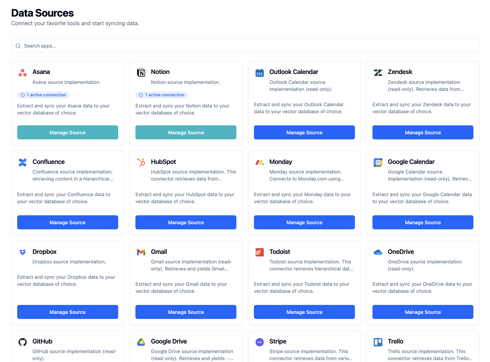
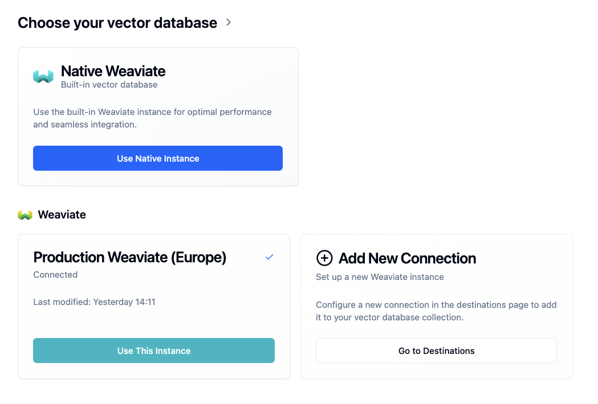
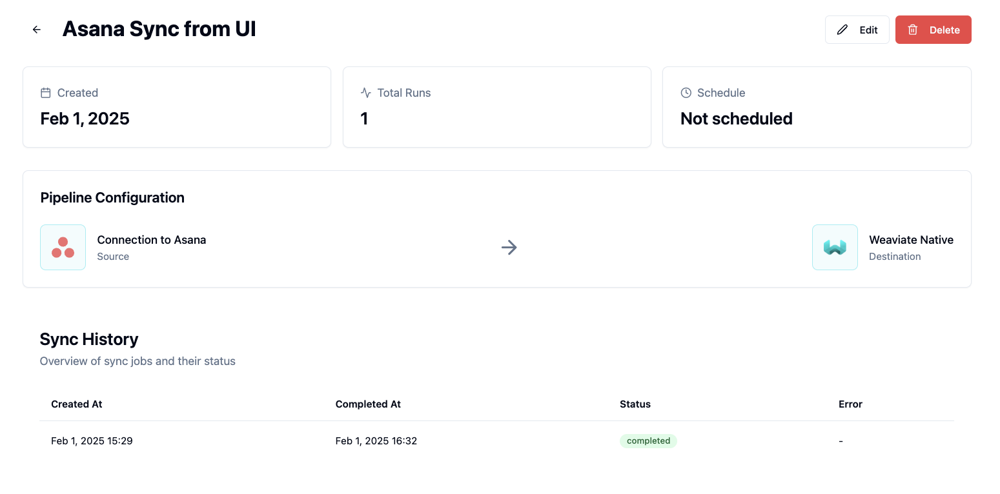
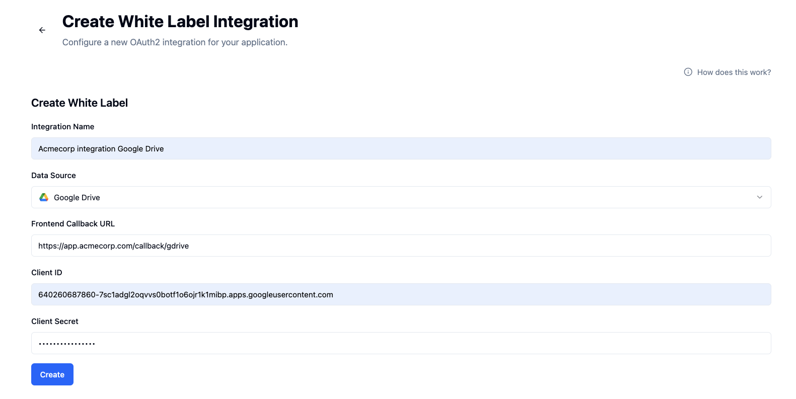

Airweave is built around several key concepts that work together to create a powerful agent knowledge platform. This guide will walk you through each concept and how they fit together to make your data searchable and accessible.


<Note>
We're here to help! If you have any questions or feedback, please [contact us](mailto:support@airweave.ai).

</Note>

## Data Sources

<Frame background="subtle" caption="Selecting data sources">
  
</Frame>

Data source connectors are the entry points for your information into Airweave. We
support a [wide range of sources](https://github.com/airweave-ai/airweave/tree/main/backend/airweave/platform/sources) to ensure you can connect all your valuable data.

### Supported Source Types

<Tabs>
  <Tab title="APIs">
    Connect to external services through their REST APIs:
    - Enterprise tools like Slack and Gmail
    - Custom internal APIs
    - Third-party service integrations
  </Tab>
  <Tab title="Databases">
    Direct integration with your existing data stores:
    - SQL databases (PostgreSQL, MySQL, etc.)
    - NoSQL databases (MongoDB, DynamoDB)
    - Time-series databases
  </Tab>
  <Tab title="File Systems (coming soon)">
    Process documents and files from:
    - Local file systems
    - Cloud storage (S3, GCS, Azure Blob)
    - Network-attached storage (SFTP)
  </Tab>
  <Tab title="Web Content (coming soon)">
    Index content from: - Public websites - Internal documentation - Web
    applications
  </Tab>
</Tabs>

## Destinations

Your processed data is stored in vector databases optimized for semantic search operations.

<Warning>
  Currently, Airweave only supports vector databases as destinations. Support
  for additional destination types - such as **graph databases** - will come very soon.
</Warning>

You can either use the native Weaviate database, or connect to an existing database of your choice.

<Frame background="subtle" caption="Selecting destinations">
  
</Frame>


## Entities

Entities are the fundamental building blocks that power Airweave's search
capabilities. They provide a standardized way to represent information across
different platforms and integrations, making your data uniformly searchable.

<Note>
Entities are the smallest unit of data in Airweave. Every entity has an **entity_id** and belongs to a **sync job**, which in turn belongs to a <a href="#synchronization">sync</a>.
During ingestion, entities are hashed and version-tracked in the Airweave database. This allows for efficient deduplication and change detection.
</Note>

#### Core Structure

Every entity in Airweave inherits from a base structure that ensures consistency and searchability:

<CodeBlock title="Base Entity Structure">
```python
class BaseEntity(BaseModel):
  """Base class for all entities."""
  entity_id: str # Unique identifier from platform
  breadcrumbs: list[Breadcrumb] # Tracks ancestry/hierarchy
```
</CodeBlock>

These entities are extended by platform-specific entities:

<CodeBlock title="Slack Message Entity">
```python
class SlackMessageEntity(ChunkEntity):
  """Schema for Slack message entities."""

  channel_id: str
  user_id: Optional[str] = None
  text: Optional[str] = None
  ...
```
</CodeBlock>


## Synchronization
A synchronization in Airweave orchestrates sync jobs and scopes your data in the target destination.

This may be only one sync job if triggered manually or via API.

Sync jobs bring together a source connection with a destination, ensuring your data stays synchronized.


<Frame background="subtle" caption="Sync overview of a manually triggered sync">
  
</Frame>

### Sync Jobs
Each sync contains one or more sync jobs, which are the individual data syncs that are executed.

<Note>
We're working on detailed logs and metrics, which will allow you to monitor performance and troubleshoot any issues that arise during the synchronization process.
</Note>

#### <Icon icon="mouse"/> Manual Sync
One-off sync jobs that you can trigger via UI for immediate execution. Great for:
* Checking if the vectorization and search strategy works for your agent
* Testing new connections
* Debugging pipeline issues
* Quick data refreshes


#### <Icon icon="clock"/> Scheduled Sync
Automated sync jobs that run on a predefined schedule. This is useful if you want to sync data on a regular basis, for example every hour, day or week. Airweave will automatically trigger the sync at the specified interval.


#### <Icon icon="code"/> API Triggered
Programmatically control syncs through our API. This is useful if you want to trigger on specific events for your agent or data source.

<CodeBlock>
```python
from airweave import AirweaveSDK

client = AirweaveSDK(api_key="YOUR_API_KEY")

client.sync.run_sync(
    sync_id="your-sync-id",
)

```
</CodeBlock>

Refer to the Sync API Reference for more information on how to trigger syncs via API.


### White Labeling Authentication
White labeling allows you to integrate 3rd party OAuth2 authentication with Airweave. This way you can use Airweave to pull your users data into your own application, without having to deal
with OAuth2 authentication or storing user credentials.

<Frame background="subtle" caption="White Labeling Authentication">
  
</Frame>

Refer to the [White Labeling](/white-labeling) documentation for more information on how to set up white labeling.
