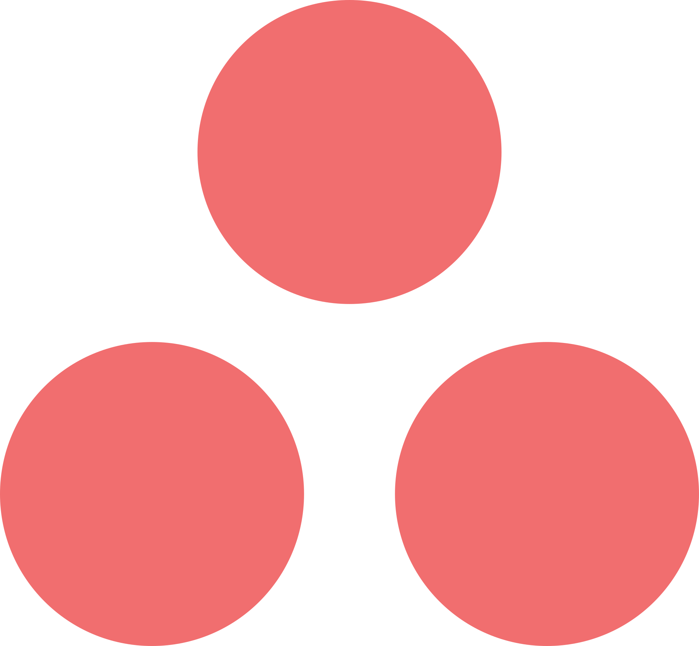

{/* AUTO-GENERATED CONTENT START */}

  
  

    <h1>Asana</h1>
    
Connect your Asana data to Airweave

  

## Overview

The Asana connector allows you to sync data from Asana into Airweave, making it available for search and retrieval by your agents.

## Configuration

### AsanaSource

Asana source implementation.

<Card
  title="View Source Code"
  icon="brands github"
  href="https://github.com/airweave-ai/airweave/tree/main/backend/airweave/platform/sources/asana.py"
>
  Explore the Asana connector implementation
</Card>

### Authentication

This connector uses **OAuth 2.0 with refresh token**.

<Card
  title="Authentication Configuration"
  className="auth-config-card"
  style={{ backgroundColor: 'rgba(0, 0, 0, 0.1)', padding: '16px', marginBottom: '24px' }}
>

Asana authentication credentials schema.
<ParamField
  path="refresh_token"
  type="str"
  required={true}
>
  The refresh token for your Asana app.
</ParamField>
<ParamField
  path="access_token"
  type="str"
  required={true}
>
  The access token for your Asana app.
</ParamField>
</Card>

## Entities

The following data models are available for this connector:

<Accordion title="AsanaWorkspaceEntity">

Schema for Asana workspace entities.

| Field | Type | Description |
|-------|------|-------------|
| name | str | The name of the workspace |
| asana_gid | str | Globally unique identifier of the workspace |
| is_organization | bool | Whether the workspace is an organization |
| email_domains | List[str] | List of email domains that can access this workspace |
| permalink_url | Optional[str] | URL to access the workspace in the Asana application |

</Accordion>
<Accordion title="AsanaProjectEntity">

Schema for Asana project entities.

| Field | Type | Description |
|-------|------|-------------|
| name | str | The name of the project |
| workspace_gid | str | Globally unique identifier of the workspace the project belongs to |
| workspace_name | str | The name of the workspace the project belongs to |
| color | Optional[str] | Color of the project (e.g. 'dark-pink', 'light-blue') |
| archived | bool | Whether the project is archived |
| created_at | Optional[datetime] | The time at which this project was created |
| current_status | Optional[Dict] | The current status update for this project |
| default_view | Optional[str] | The default view of the project (list, board, calendar, timeline) |
| due_date | Optional[str] | The day on which this project is due (YYYY-MM-DD format) |
| due_on | Optional[str] | The day on which this project is due (YYYY-MM-DD format) |
| html_notes | Optional[str] | HTML formatted note content of the project |
| notes | Optional[str] | Free-form textual information associated with the project |
| is_public | bool | Whether the project is public to its team |
| start_on | Optional[str] | The day on which this project starts (YYYY-MM-DD format) |
| modified_at | Optional[datetime] | The time at which this project was last modified |
| owner | Optional[Dict] | The owner of this project |
| team | Optional[Dict] | The team that this project is associated with |
| members | List[Dict] | Array of users who are members of this project |
| followers | List[Dict] | Array of users following this project |
| custom_fields | List[Dict] | Array of custom field values applied to the project |
| custom_field_settings | List[Dict] | Array of custom field settings for this project |
| default_access_level | Optional[str] | Default access level for the project (editor, commenter, viewer) |
| icon | Optional[str] | The icon for a project |
| permalink_url | Optional[str] | URL to access the project in the Asana application |

</Accordion>
<Accordion title="AsanaSectionEntity">

Schema for Asana section entities.

| Field | Type | Description |
|-------|------|-------------|
| name | str | The name of the section |
| project_gid | str | Globally unique identifier of the project this section belongs to |
| created_at | Optional[datetime] | The time at which this section was created |
| projects | List[Dict] | Deprecated. Array of projects this section is associated with |

</Accordion>
<Accordion title="AsanaTaskEntity">

Schema for Asana task entities.

| Field | Type | Description |
|-------|------|-------------|
| name | str | The name of the task |
| project_gid | str | Globally unique identifier of the project this task belongs to |
| section_gid | Optional[str] | Globally unique identifier of the section this task belongs to |
| actual_time_minutes | Optional[int] | The actual time spent on this task in minutes |
| approval_status | Optional[str] | The status of the task's approval, if applicable |
| assignee | Optional[Dict] | User to which this task is assigned |
| assignee_status | Optional[str] | The scheduling status of this task for the user it's assigned to |
| completed | bool | Whether the task is marked complete |
| completed_at | Optional[datetime] | The time at which this task was completed |
| completed_by | Optional[Dict] | The user who completed this task |
| created_at | Optional[datetime] | The time at which this task was created |
| dependencies | List[Dict] | Array of tasks that this task depends on |
| dependents | List[Dict] | Array of tasks that depend on this task |
| due_at | Optional[datetime] | The time at which this task is due with a time component |
| due_on | Optional[str] | The date on which this task is due (YYYY-MM-DD format) |
| external | Optional[Dict] | Information about the external application syncing with this task |
| html_notes | Optional[str] | HTML formatted note content of the task |
| notes | Optional[str] | Free-form textual information associated with the task |
| is_rendered_as_separator | bool | Whether the task is rendered as a separator in list view |
| liked | bool | Whether the task is liked by the authorized user |
| memberships | List[Dict] | Array of projects and sections this task is in |
| modified_at | Optional[datetime] | The time at which this task was last modified |
| num_likes | int | The number of users who have liked this task |
| num_subtasks | int | The number of subtasks on this task |
| parent | Optional[Dict] | The parent of this task, if applicable |
| permalink_url | Optional[str] | URL to access the task in the Asana application |
| resource_subtype | str | The subtype of the task (default_task, milestone, approval) |
| start_at | Optional[datetime] | The time at which this task starts with a time component |
| start_on | Optional[str] | The date on which this task starts (YYYY-MM-DD format) |
| tags | List[Dict] | Array of tags associated with this task |
| custom_fields | List[Dict] | Array of custom field values applied to the task |
| followers | List[Dict] | Array of users following this task |
| workspace | Optional[Dict] | The workspace this task is associated with |

</Accordion>
<Accordion title="AsanaCommentEntity">

Schema for Asana comment/story entities.

| Field | Type | Description |
|-------|------|-------------|
| task_gid | str | Globally unique identifier of the task this comment belongs to |
| author | Dict | The user who created this comment |
| created_at | datetime | The time at which this comment was created |
| resource_subtype | str | The subtype of the comment resource |
| text | Optional[str] | The plain text content of the comment |
| html_text | Optional[str] | HTML formatted content of the comment |
| is_pinned | bool | Whether the comment is pinned to the task |
| is_edited | bool | Whether the comment has been edited |
| sticker_name | Optional[str] | The name of the sticker (for sticker comments) |
| num_likes | int | The number of users who have liked this comment |
| liked | bool | Whether the comment is liked by the authorized user |
| type | str | The type of the comment (comment or system) |
| previews | List[Dict] | Previews of attachments referenced in the comment |

</Accordion>

{/* AUTO-GENERATED CONTENT END */}
