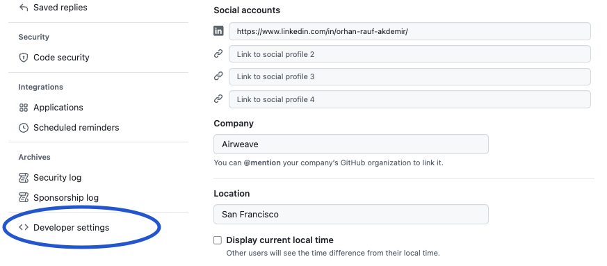
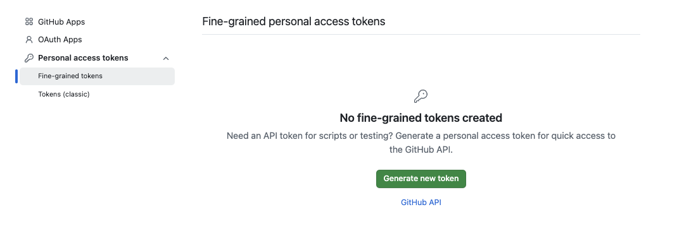
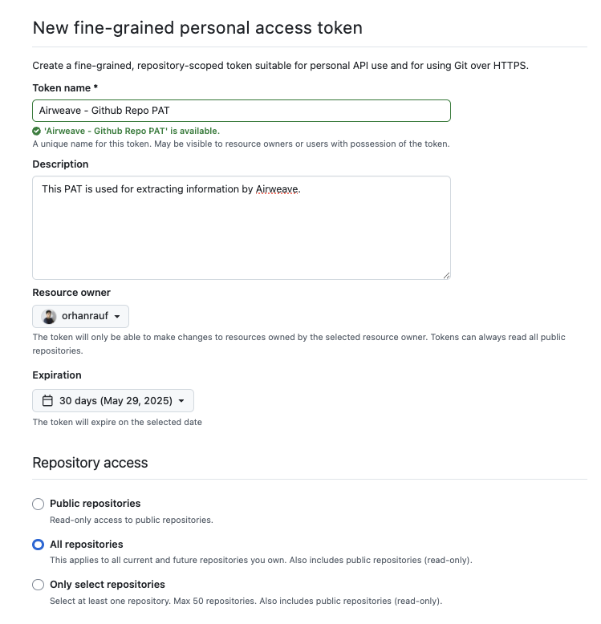
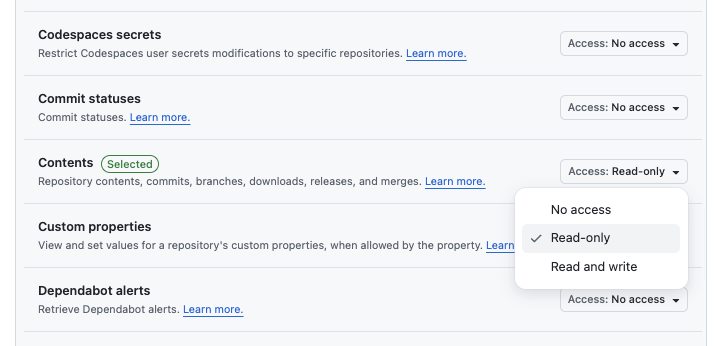

{/* AUTO-GENERATED CONTENT START */}

  
  

    <h1>Github</h1>
    
Connect your Github data to Airweave

  

## Overview

The Github connector allows you to sync data from Github into Airweave, making it available for search and retrieval by your agents.

## Configuration

### GitHubSource

GitHub source implementation.

<Card
  title="View Source Code"
  icon="brands github"
  href="https://github.com/airweave-ai/airweave/tree/main/backend/airweave/platform/sources/github.py"
>
  Explore the Github connector implementation
</Card>

### Authentication

This connector uses a custom authentication configuration class: `GitHubAuthConfig`.

<Card
  title="Authentication Configuration"
  className="auth-config-card"
  style={{ backgroundColor: 'rgba(0, 0, 0, 0.1)', padding: '16px', marginBottom: '24px' }}
>

GitHub authentication credentials schema.
<ParamField
  path="personal_access_token"
  type="str"
  required={true}
>
  GitHub PAT with read rights (code, contents, metadata) to the repository
</ParamField>
<ParamField
  path="repo_name"
  type="str"
  required={true}
>
  Repository to sync in owner/repo format (e.g., 'airweave-ai/airweave')
</ParamField>
</Card>

## Entities

The following data models are available for this connector:

<Accordion title="GitHubDirectoryEntity">

Schema for GitHub directory entity.

| Field | Type | Description |
|-------|------|-------------|
| path | str | Path of the directory within the repository |
| repo_name | str | Name of the repository containing this directory |
| repo_owner | str | Owner of the repository |

</Accordion>
<Accordion title="GithubRepoEntity">

Schema for a GitHub repository.

References:
  https://docs.github.com/en/rest/repos/repos?apiVersion=2022-11-28

| Field | Type | Description |
|-------|------|-------------|
| name | Optional[str] | Name of the repository. |
| full_name | Optional[str] | Full name (including owner) of the repo. |
| owner_login | Optional[str] | Login/username of the repository owner. |
| private | bool | Whether the repository is private. |
| description | Optional[str] | Short description of the repository. |
| fork | bool | Whether this repository is a fork. |
| created_at | Optional[datetime] | When the repository was created. |
| updated_at | Optional[datetime] | When the repository was last updated. |
| pushed_at | Optional[datetime] | When the repository was last pushed. |
| homepage | Optional[str] | Homepage URL for the repository. |
| size | Optional[int] | Size of the repository (in kilobytes). |
| stargazers_count | int | Number of stars on this repository. |
| watchers_count | int | Number of people watching this repository. |
| language | Optional[str] | Primary language of the repository. |
| forks_count | int | Number of forks for this repository. |
| open_issues_count | int | Number of open issues on this repository. |
| topics | List[str] | Topics/tags applied to this repo. |
| default_branch | Optional[str] | Default branch name of the repository. |
| archived | bool | Whether the repository is archived. |
| disabled | bool | Whether the repository is disabled in GitHub. |

</Accordion>
<Accordion title="GithubContentEntity">

Schema for a GitHub repository's content (file, directory, submodule, etc.).

References:
  https://docs.github.com/en/rest/repos/contents?apiVersion=2022-11-28

| Field | Type | Description |
|-------|------|-------------|
| repo_full_name | Optional[str] | Full name of the parent repository. |
| path | Optional[str] | Path of the file or directory within the repo. |
| sha | Optional[str] | SHA identifier for this content item. |
| item_type | Optional[str] | Type of content. Typically 'file', 'dir', 'submodule', or 'symlink'. |
| size | Optional[int] | Size of the content (in bytes). |
| html_url | Optional[str] | HTML URL for viewing this content on GitHub. |
| download_url | Optional[str] | Direct download URL if applicable. |
| content | Optional[str] | File content (base64-encoded) if retrieved via 'mediaType=raw' or similar. |
| encoding | Optional[str] | Indicates the encoding of the content (e.g., 'base64'). |

</Accordion>

{/* AUTO-GENERATED CONTENT END */}

## Setting up a GitHub Personal Access Token for Airweave

To connect your GitHub repositories to Airweave, you'll need to create a Personal Access Token (PAT) with the appropriate permissions. This guide walks you through the process of creating and configuring a fine-grained token for use with Airweave.

### Step 1: Access Developer Settings in GitHub

Navigate to your GitHub account settings by clicking on your profile picture in the top right corner, then select "Settings". From there, scroll down to find and click on "Developer settings" in the left sidebar.

### Step 2: Create a New Fine-Grained Token

In the Developer settings page, select "Fine-grained tokens" from the left menu, then click on "Generate new token".

### Step 3: Configure Your Token

Fill out the token form with the following details:

1. **Token name**: Choose a descriptive name like "Airweave Integration"
2. **Expiration**: Select an appropriate expiration date (recommended: 1 year for production use)
3. **Repository access**: Choose either "All repositories" or select specific repositories you want to connect to Airweave

### Step 4: Set Required Permissions

For the GitHub connector to work properly, you need to grant the following permissions:

Under "Repository permissions":
- Set "Contents" to "Read-only" - This allows Airweave to read repository files

### Step 5: Generate and Save Your Token

After configuring the permissions, scroll to the bottom of the page and click "Generate token".

**Important**: GitHub will display your token only once. Make sure to copy and store it in a secure location, as you won't be able to view it again.

### Step 6: Add Your Token to Airweave

When setting up the GitHub connector in Airweave:
1. Paste your personal access token in the "Personal Access Token" field
2. Enter the repository name in the format `owner/repo` (e.g., `airweave-ai/airweave`)

Your GitHub repository is now connected to Airweave and ready for synchronization.
