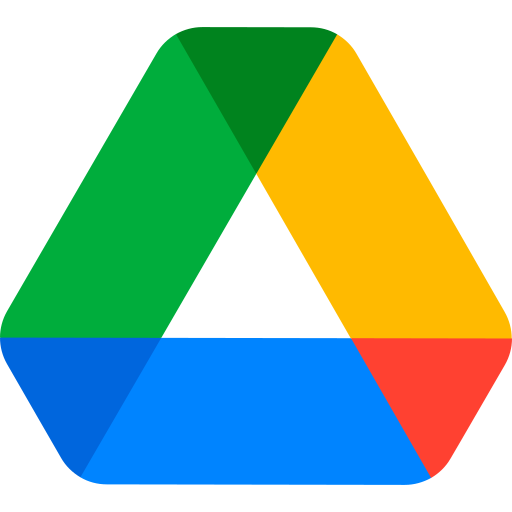

{/* AUTO-GENERATED CONTENT START */}


<div className="connector-header">
  
  <div className="connector-info">
    <h1>Google Drive</h1>
    <p>Connect your Google Drive data to Airweave</p>
  </div>
</div>

## Overview

The Google Drive connector allows you to sync data from Google Drive into Airweave, making it available for search and retrieval by your agents.

## Configuration


### GoogleDriveSource

Google Drive source implementation (read-only).

Retrieves and yields:
  - GoogleDriveDriveEntity objects, representing shared drives
  - GoogleDriveFileEntity objects, representing files in each shared drive
  - GoogleDriveFileEntity objects, representing files in the user's My Drive


<Card
  title="View Source Code"
  icon="brands github"
  href="https://github.com/airweave-ai/airweave/tree/main/backend/airweave/platform/sources/google_drive.py"
>
  Explore the Google Drive connector implementation
</Card>

### Authentication

This connector uses **OAuth 2.0 with refresh token**.

<Card
  title="Authentication Configuration"
  className="auth-config-card"
  style={{ backgroundColor: 'rgba(0, 0, 0, 0.1)', padding: '16px', marginBottom: '24px' }}
>

Google Drive authentication credentials schema.
<ParamField
  path="client_id"
  type="Optional[str]"
  required={false}
>
  The OAuth client ID for your Google app
</ParamField>
<ParamField
  path="client_secret"
  type="Optional[str]"
  required={false}
>
  The OAuth client secret for your Google app
</ParamField>
<ParamField
  path="refresh_token"
  type="str"
  required={true}
>
  The refresh token for your Google Drive app.
</ParamField>
<ParamField
  path="access_token"
  type="str"
  required={true}
>
  The access token for your Google Drive app.
</ParamField>
</Card>


## Entities

The following data models are available for this connector:

<Accordion title="GoogleDriveDriveEntity">

Schema for a Drive resource (shared drive).

Reference:
  https://developers.google.com/drive/api/v3/reference/drives

| Field | Type | Description |
|-------|------|-------------|
| drive_id | str | Unique ID of the shared drive. |
| name | Optional[str] | The name of this shared drive. |
| kind | Optional[str] | Identifies what kind of resource this is; typically "drive#drive". |
| color_rgb | Optional[str] | The color of this shared drive as an RGB hex string. |
| created_time | Optional[datetime] | When the shared drive was created (RFC 3339 date-time). |
| hidden | bool | Whether the shared drive is hidden from default view. |
| org_unit_id | Optional[str] | The organizational unit of this shared drive, if applicable. |

</Accordion>


{/* AUTO-GENERATED CONTENT END */}

## Integrate Airweave with Google APIs on localhost

This guide will walk you through connecting Google Workspace APIs to Airweave when running locally.
Google provides extensive [documentation](https://developers.google.com/workspace/guides/get-started) on setting up your workspace.
Below is a streamlined process for connecting Google APIs to Airweave.

1. [Create a Google Cloud project](https://developers.google.com/workspace/guides/create-project) for your Google Workspace (if you don't already have one)
2. [Enable the Google Workspace APIs](https://developers.google.com/workspace/guides/enable-apis) for Gmail, Google Calendar, and Google Drive
3. [Configure Google OAuth 2.0 consent screen](https://developers.google.com/workspace/guides/configure-oauth-consent)
4. Under `Audience`, select `Make external` and add test users
5. Under `Data Access`, add the following scopes:

```
https://www.googleapis.com/auth/docs
https://www.googleapis.com/auth/drive.photos.readonly
https://www.googleapis.com/auth/drive
https://www.googleapis.com/auth/drive.readonly
https://www.googleapis.com/auth/drive.metadata
https://www.googleapis.com/auth/drive.metadata.readonly
https://www.googleapis.com/auth/gmail.readonly
https://www.googleapis.com/auth/calendar.events.public.readonly
https://www.googleapis.com/auth/calendar.freebusy
https://www.googleapis.com/auth/calendar.readonly
https://www.googleapis.com/auth/calendar.calendars.readonly
https://www.googleapis.com/auth/calendar.events.owned.readonly
https://www.googleapis.com/auth/calendar.events.readonly
```
6. [Create OAuth client ID credentials](https://developers.google.com/workspace/guides/create-credentials#oauth-client-id)
7. Under "Authorized redirect URIs," click "+ Add URI" and add the following URIs:
   ```
   http://localhost:8080/auth/callback/gmail
   ```
   ```
   http://localhost:8080/auth/callback/google_calendar
   ```
   ```
   http://localhost:8080/auth/callback/google_drive
   ```
8. Locate the client ID and client secret from your newly created OAuth client. Add these credentials to the `dev.integrations.yml` file to enable Google API integration.
