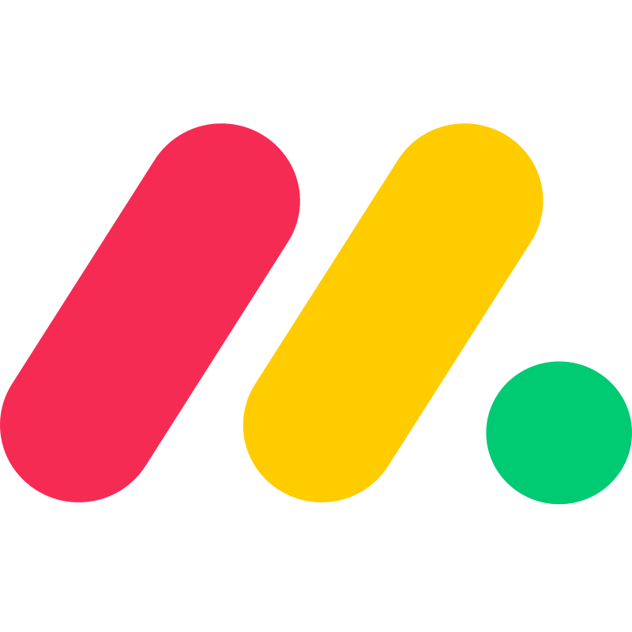

{/* AUTO-GENERATED CONTENT START */}

  
  

    <h1>Monday</h1>
    
Connect your Monday data to Airweave

  

## Overview

The Monday connector allows you to sync data from Monday into Airweave, making it available for search and retrieval by your agents.

## Configuration

### MondaySource

Monday source implementation.

    Connects to Monday.com using GraphQL queries to retrieve and entity various
    data types including boards, groups, columns, items, subitems, and updates.

{/* AUTO-GENERATED CONTENT END */}
