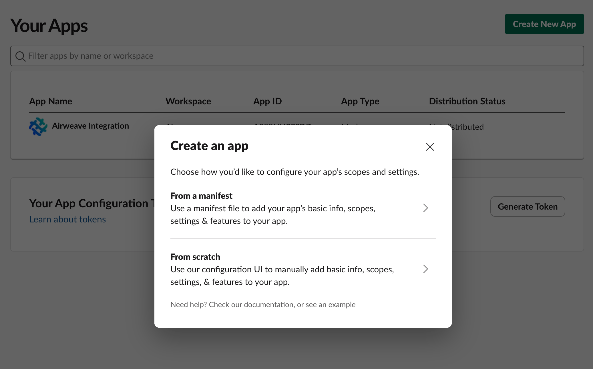
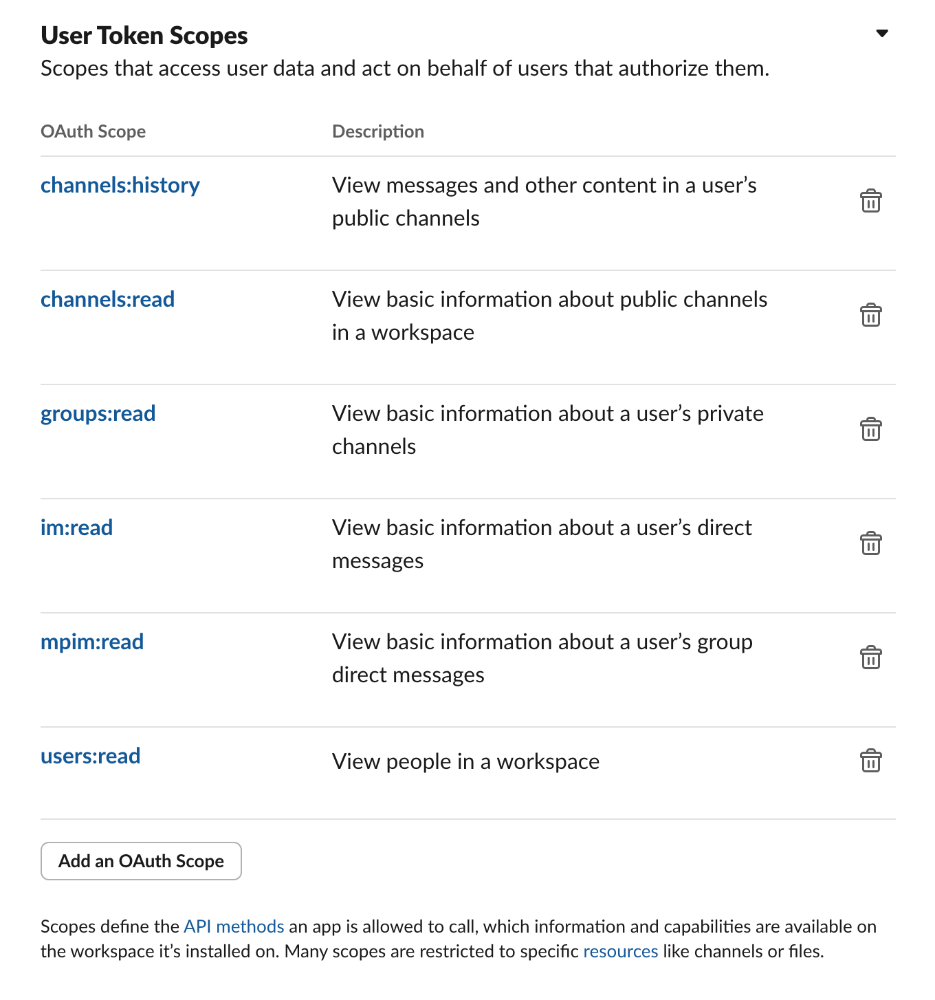
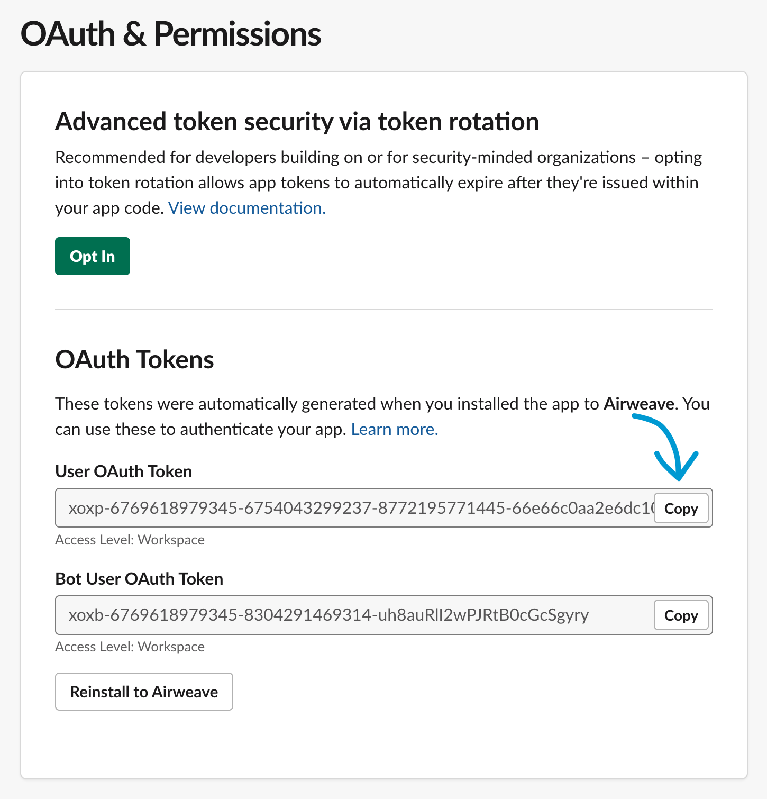

{/* AUTO-GENERATED CONTENT START */}

  
  

    <h1>Slack</h1>
    
Connect your Slack data to Airweave

  

## Overview

The Slack connector allows you to sync data from Slack into Airweave, making it available for search and retrieval by your agents.

## Configuration

### SlackSource

Slack source implementation.

This connector retrieves data from Slack such as Channels, Users, and Messages,
then yields them as entities using their respective Slack entity schemas.

<Card
  title="View Source Code"
  icon="brands github"
  href="https://github.com/airweave-ai/airweave/tree/main/backend/airweave/platform/sources/slack.py"
>
  Explore the Slack connector implementation
</Card>

### Authentication

This connector uses **OAuth 2.0 authentication flow**.

<Card
  title="Authentication Configuration"
  className="auth-config-card"
  style={{ backgroundColor: 'rgba(0, 0, 0, 0.1)', padding: '16px', marginBottom: '24px' }}
>

Slack authentication credentials schema.
<ParamField
  path="access_token"
  type="str"
  required={true}
>
  The access token for your Slack app.
</ParamField>
</Card>

## Entities

The following data models are available for this connector:

<Accordion title="SlackChannelEntity">

Schema for Slack channel entities.

| Field | Type | Description |
|-------|------|-------------|
| channel_id | str | Unique identifier for the channel |
| name | Optional[str] | Human-readable name of the channel |
| is_channel | bool | Whether this is a public channel |
| is_group | bool | Whether this is a private channel/group |
| is_im | bool | Whether this is a direct message (IM) |
| is_mpim | bool | Whether this is a multi-person direct message |
| is_archived | bool | Whether the channel has been archived |
| created | Optional[datetime] | Timestamp when the channel was created |
| creator | Optional[str] | User ID of the channel creator |
| members | List[str] | List of user IDs who are members of this channel |
| topic | Optional[Dict] | Information about the channel topic including value and creator |
| purpose | Optional[Dict] | Information about the channel purpose including value and creator |

</Accordion>
<Accordion title="SlackUserEntity">

Schema for Slack user entities.

| Field | Type | Description |
|-------|------|-------------|
| user_id | str | Unique identifier for the user |
| team_id | Optional[str] | Identifier for the team/workspace the user belongs to |
| name | Optional[str] | The username/handle of the user |
| real_name | Optional[str] | The user's real/full name |
| display_name | Optional[str] | The display name set by the user |
| is_bot | bool | Whether the user is a bot |
| is_admin | bool | Whether the user has admin privileges |
| is_owner | bool | Whether the user is an owner of the workspace |
| is_primary_owner | bool | Whether the user is the primary owner of the workspace |
| is_restricted | bool | Whether the user is a restricted user (guest) |
| is_ultra_restricted | bool | Whether the user is an ultra-restricted user (single-channel guest) |
| updated | Optional[datetime] | Timestamp when the user profile was last updated |

</Accordion>
<Accordion title="SlackMessageEntity">

Schema for Slack message entities.

| Field | Type | Description |
|-------|------|-------------|
| channel_id | str | ID of the channel the message was posted in |
| user_id | Optional[str] | ID of the user who sent the message |
| text | Optional[str] | The message text content |
| ts | Optional[str] | Unique timestamp identifier for the message (format: '1664998373.018700') |
| thread_ts | Optional[str] | Timestamp of the parent message in a thread |
| team | Optional[str] | Team/workspace ID the message belongs to |
| attachments | List[Dict] | Legacy message attachments |
| blocks | List[Dict] | Block Kit blocks in the message |
| files | List[Dict] | Files attached to the message |
| reactions | List[Dict] | Emoji reactions added to the message |
| is_bot | bool | Whether the message was sent by a bot |
| subtype | Optional[str] | Message subtype for special messages (like joins, leaves) |
| edited | Optional[Dict] | Information about message edits including timestamp and user |

</Accordion>

{/* AUTO-GENERATED CONTENT END */}

-------

# Integrate with Slack on localhost

This guide will walk you through connecting your Slack workspace to Airweave when run locally. Slack does not allow OAuth2 flows for `http://localhost`, so this is a workaround.

## Prerequisites

- Access to a Slack workspace where you have permissions to add apps
- Administrator access to your Airweave instance

## Steps to Connect

### 1. Create a Slack App

1. Go to [https://api.slack.com/apps](https://api.slack.com/apps)
2. Click the "Create New App" button
3. Choose "From scratch"
4. Enter a name for your app (e.g., "Airweave")
5. Select the workspace you want to connect
6. Click "Create App"'

### 2. Configure OAuth Permissions

1. In your Slack app settings, navigate to "OAuth & Permissions" in the sidebar
2. Scroll down to the "Scopes" section
3. Under "User Token Scopes", add the following scopes:
   - `channels:history`
   - `channels:read`
   - `groups:read`
   - `im:read`
   - `mpim:read`
   - `users:read`

  

### 3. Install the App to Your Workspace

1. Scroll back to the top of the "OAuth & Permissions" page
2. Click the **Install to Workspace** button
3. Review the permissions and click "Allow"
4. After installation, you'll be redirected back to the app settings
5. Copy the "User OAuth Token" (it starts with `xoxp-`)

### 4. Add the Token to Airweave

1. In your Airweave application, navigate to the integrations section
2. Select "Slack" from the available integrations
3. Paste the Bot User OAuth Token you copied in the previous step
4. Complete any additional configuration required by Airweave
5. Save your changes

## Verification

After completing these steps, Airweave should be connected to your Slack workspace. You can verify this by checking the status of the integration in Airweave's dashboard.

## Troubleshooting

- If you encounter permission errors, ensure you've added all required scopes to your Slack app
- If the connection fails, verify that the token was copied correctly and hasn't expired
- For workspace connection issues, ensure you have the appropriate admin permissions in your Slack workspace
