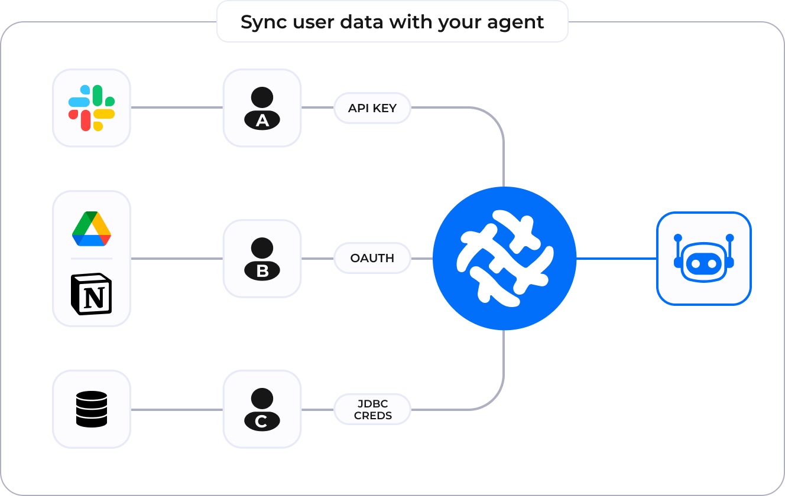

Airweave's white labeling feature enables you to create multi-tenant integrations that maintain data isolation and security while providing a seamless experience for your users.

This allows you to give customers a simple way to hand off their data to you.

## Overview

White labeling in Airweave allows you to:

- Manage OAuth2 flows for multiple tenants
- Maintain data isolation between tenants


## Example Workflow

1. Customer clicks "Connect to Service" in your app
2. Airweave handles OAuth2 authorization
3. Tokens are securely stored and linked to tenant
4. Data sync begins automatically
5. Your app queries data using tenant metadata


<Card
  title="airweave-ai/oauth2-whitelabel-demo-app"
  icon="brands github"
  href="https://github.com/airweave-ai/oauth2-whitelabel-demo-app"
>
  View a complete demo app showing how to implement OAuth2 white labeling with Asana
</Card>


## How It Works

### Token Management

After the OAuth2 flow completes, Airweave:

1. **Securely stores tokens**:
   - Access tokens for API authentication
   - Refresh tokens for automatic token renewal
   - Links tokens to your provided tenant metadata

2. **Handles token lifecycle**:
   - Automatically refreshes expired access tokens
   - Maintains uninterrupted synchronization
   - Manages API authentication behind the scenes

<Note>
Any questions about how this works exactly? [Contact us](mailto:support@airweave.ai) and we'll be happy to help!
</Note>


## Setting Up White Label Integration

### 1. White Label Configuration

First, create a white label configuration either through the UI or programmatically.

#### Option A: Using the Airweave UI

<Frame title="White Label Configuration">
  
</Frame>

#### Option B: Using the SDK

<CodeBlock title="Create a white label configuration">
```typescript
import { AirweaveSDK } from "@airweave/sdk";

const client = new AirweaveSDK({
  apiKey: "your-api-key",
});

const integration = await client.whiteLabels.create({
  name: "Custom Integration",
  sourceId: "source-uuid", // UUID of the source to connect to
  redirectUrl: "https://your-app.com/oauth/callback",
  clientId: "your-oauth-client-id",
  clientSecret: "your-oauth-client-secret",
});
```
</CodeBlock>

### 2. Initiating OAuth2 Flow

Create a component that redirects users to the OAuth2 authorization screen:

<CodeBlock title="Connect Source Button">
```tsx
import { Button } from "@/components/ui/button";
import { useApiClient } from "@/lib/api";
import { useRouter } from "next/router";
import { ExternalLink } from "lucide-react";

interface ConnectSourceProps {
  sourceId: string;
  organizationId: string;
}

export function ConnectSource({ sourceId, organizationId }: ConnectSourceProps) {
  const apiClient = useApiClient();
  const router = useRouter();

  const handleConnect = async () => {
    try {
      const { authUrl } = await apiClient.whiteLabels.getOauth2AuthUrl({
        whiteLabelId: integration.id,
        state: organizationId,
      });
      
      router.push(authUrl);
    } catch (error) {
      console.error("Failed to get auth URL:", error);
    }
  };

  return (
    <Button 
      onClick={handleConnect}
      variant="outline"
    >
      Connect Source <ExternalLink className="ml-2 h-4 w-4" />
    </Button>
  );
}
```
</CodeBlock>

### 3. Handling OAuth2 Callback

Create a callback handler component to process the OAuth2 response:

<CodeBlock title="OAuth Callback Handler">
```tsx
interface CallbackProps {
  whiteLabelId: string;
}

export function OAuthCallback({ whiteLabelId }: CallbackProps) {
  const apiClient = useApiClient();
  const router = useRouter();
  const { code, state } = router.query;

  useEffect(() => {
    const handleCallback = async () => {
      if (!code || !state) return;

      try {
        await apiClient.whiteLabels.exchangeOauth2Code({
          whiteLabelId,
          code: code as string,
          metadata: {
            organizationId: state as string,
          },
        });

        router.push('/integrations/success');
      } catch (error) {
        console.error('OAuth callback failed:', error);
        router.push('/integrations/error');
      }
    };

    handleCallback();
  }, [code, state, whiteLabelId, apiClient, router]);

  return (
    <div className="flex items-center justify-center min-h-screen">
      <div className="text-center">
        <h2 className="text-lg font-semibold mb-2">Connecting your account...</h2>
        <p className="text-muted-foreground">Please wait while we complete the setup.</p>
      </div>
    </div>
  );
}
```
</CodeBlock>

### Data Synchronization

Once authentication is complete, Airweave:

1. **Processes data efficiently**:
   - Runs incremental syncs to fetch only new/updated data
   - Chunks data for optimal processing
   - Applies versioning and computes hashes for deduplication

2. **Maintains tenant isolation**:
   - Uses your provided metadata (organization ID, user details) to isolate data
   - Ensures secure multi-tenant operations
   - Enables tenant-specific data enrichment

## Architecture

<Frame title="White Label Architecture">
  
</Frame>

The architecture diagram above illustrates how Airweave handles different authentication methods across multiple data sources:

- **API Key Integration**: Users (like User A) can connect services that use API key authentication (e.g., Slack)
- **OAuth Integration**: Users (like User B) can connect services that require OAuth authentication (e.g., Google Drive, Notion)
- **Database Integration**: Users (like User C) can connect directly to databases using JDBC credentials

All these connections are managed through Airweave's white-labeling system, which:
1. Securely stores and manages credentials
2. Maintains strict tenant isolation
3. Handles authentication renewals automatically
4. Synchronizes data to your agent while preserving tenant context

This architecture ensures that regardless of the authentication method, all data is properly isolated and securely managed while providing a unified interface for your application.
