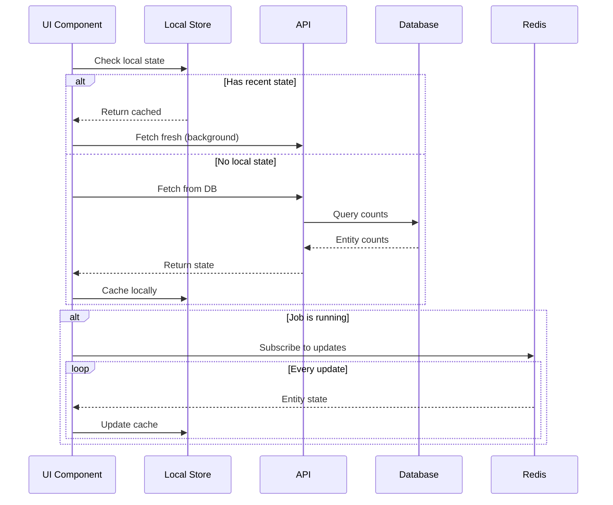

I'll research the codebase deeply to create a comprehensive design document with all the implementation details you've requested.

[10 tools called]

# Comprehensive Design Document: Entity State Management System

## Executive Summary

This document details the architectural refactoring of the Source Connection Detail View from DAG visualization to an entity state-focused interface. The new system provides real-time visibility into actual data state with sophisticated three-layer state management (local → database → stream) and total count tracking instead of differential updates.

## Table of Contents
1. [Architecture Overview](#1-architecture-overview)
2. [State Management Architecture](#2-state-management-architecture)
3. [Backend Implementation](#3-backend-implementation)
4. [Frontend Implementation](#4-frontend-implementation)
5. [Component Design](#5-component-design)
6. [API & Endpoint Design](#6-api--endpoint-design)
7. [Migration Strategy](#7-migration-strategy)
8. [Technical Specifications](#8-technical-specifications)

---

## 1. Architecture Overview

### 1.1 System Goals
- **Developer-centric**: Show actual entity state, not data flow mechanics
- **Real-time accuracy**: Live updates during sync with total counts
- **Progressive enhancement**: Local → DB → Stream state loading
- **Zero flicker**: Smooth transitions between state sources

### 1.2 Key Changes

| Component | Current State | Target State |
|-----------|--------------|--------------|
| **UI** | DAG visualization with flow nodes | Entity list with counts |
| **State** | Differential counts (inserted/updated) | Total counts per entity type |
| **Updates** | Incremental progress diffs | Absolute entity totals |
| **Storage** | Session storage for recovery | Zustand with persistence |

---

## 2. State Management Architecture

### 2.1 Three-Layer State Model

```typescript
interface EntityStateLayer {
  // Layer 1: Local State (Zustand store with persistence)
  local: {
    entityCounts: Map<string, EntityCount>;
    lastUpdated: Date;
    syncStatus: 'healthy' | 'running' | 'error';
    sourceConnectionId: string;
  };

  // Layer 2: Database State (API calls)
  database: {
    fetchEntityCounts: (syncId: string) => Promise<EntityCount[]>;
    fetchSyncJob: (jobId: string) => Promise<SyncJob>;
  };

  // Layer 3: Stream State (SSE/Redis)
  stream: {
    subscription: EventSource | null;
    lastMessage: EntityStateUpdate | null;
  };
}
```

### 2.2 State Transition Flow

Based on the state diagram, the system follows this precise flow:

```typescript
class EntityStateMediator {
  private localStore: EntityLocalStore;  // Zustand store
  private dbFetcher: DatabaseFetcher;
  private streamManager: StreamManager;

  async initializeState(connectionId: string): Promise<void> {
    // Step 1: Check local state
    const localState = this.localStore.getState(connectionId);

    if (localState && this.isStateRecent(localState)) {
      // Display local state immediately
      this.displayState(localState);

      // Step 2: Fetch from DB in background for freshness
      const dbState = await this.dbFetcher.fetchState(connectionId);
      this.mergeAndDisplay(localState, dbState);

      // Step 3: If running, subscribe to stream
      if (dbState.status === 'in_progress') {
        await this.streamManager.subscribe(dbState.jobId);
      }
    } else {
      // No local state - show empty state with loading indicator
      this.displayEmptyState();

      // Fetch from DB
      const dbState = await this.dbFetcher.fetchState(connectionId);
      this.displayState(dbState);
      this.localStore.setState(connectionId, dbState);

      // Subscribe if running
      if (dbState.status === 'in_progress') {
        await this.streamManager.subscribe(dbState.jobId);
      }
    }
  }

  private isStateRecent(state: LocalState): boolean {
    const age = Date.now() - state.lastUpdated.getTime();
    return age < 5000; // 5 second TTL
  }
}
```

### 2.3 Zustand Store Implementation

```typescript
// stores/entityStateStore.ts
interface EntityStateStore {
  // State
  entityStates: Map<string, SourceConnectionEntityState>;

  // Actions
  setEntityState: (connectionId: string, state: SourceConnectionEntityState) => void;
  updateFromStream: (connectionId: string, update: EntityStateUpdate) => void;
  clearState: (connectionId: string) => void;

  // Getters
  getEntityState: (connectionId: string) => SourceConnectionEntityState | null;
  getTotalCount: (connectionId: string) => number;
}

export const useEntityStateStore = create<EntityStateStore>()(
  persist(
    (set, get) => ({
      entityStates: new Map(),

      setEntityState: (connectionId, state) => {
        set((current) => {
          const newStates = new Map(current.entityStates);
          newStates.set(connectionId, {
            ...state,
            lastUpdated: new Date()
          });
          return { entityStates: newStates };
        });
      },

      updateFromStream: (connectionId, update) => {
        set((current) => {
          const existing = current.entityStates.get(connectionId);
          if (!existing) return current;

          const updated = {
            ...existing,
            entityCounts: update.entity_counts,
            totalEntities: update.total_entities,
            lastUpdated: new Date()
          };

          const newStates = new Map(current.entityStates);
          newStates.set(connectionId, updated);
          return { entityStates: newStates };
        });
      },

      clearState: (connectionId) => {
        set((current) => {
          const newStates = new Map(current.entityStates);
          newStates.delete(connectionId);
          return { entityStates: newStates };
        });
      },

      getEntityState: (connectionId) => {
        return get().entityStates.get(connectionId) || null;
      },

      getTotalCount: (connectionId) => {
        const state = get().entityStates.get(connectionId);
        if (!state) return 0;

        return Object.values(state.entityCounts)
          .reduce((sum, count) => sum + count, 0);
      }
    }),
    {
      name: 'entity-state-storage',
      // Custom serialization for Map
      serialize: (state) => {
        return JSON.stringify({
          ...state,
          entityStates: Array.from(state.entityStates.entries())
        });
      },
      deserialize: (str) => {
        const parsed = JSON.parse(str);
        return {
          ...parsed,
          entityStates: new Map(parsed.entityStates)
        };
      }
    }
  )
);
```

---

## 3. Backend Implementation

### 3.1 Enhanced Progress Tracking

#### SyncEntityStateTracker (New Class)

```python
# backend/airweave/platform/sync/entity_state_tracker.py
from typing import Dict, Optional
from uuid import UUID
from datetime import datetime
import asyncio

from airweave.crud import entity_count
from airweave.core.logging import ContextualLogger
from airweave.schemas.entity_count import EntityCountWithDefinition

class SyncEntityStateTracker:
    """Tracks total entity counts during sync, publishing absolute values."""

    def __init__(
        self,
        job_id: UUID,
        sync_id: UUID,
        initial_counts: List[EntityCountWithDefinition],
        logger: ContextualLogger
    ):
        self.job_id = job_id
        self.sync_id = sync_id
        self.logger = logger

        # Initialize with database counts
        self.entity_counts: Dict[UUID, int] = {
            count.entity_definition_id: count.count
            for count in initial_counts
        }

        # Track entity definition metadata
        self.entity_metadata: Dict[UUID, Dict] = {
            count.entity_definition_id: {
                "name": count.entity_definition_name,
                "type": count.entity_definition_type,
                "description": count.entity_definition_description
            }
            for count in initial_counts
        }

        # Publishing control
        self._lock = asyncio.Lock()
        self._last_published = datetime.utcnow()
        self._publish_interval = 0.5  # Publish every 500ms max
        self.channel = f"sync_job_state:{job_id}"

    async def update_entity_count(
        self,
        entity_definition_id: UUID,
        action: str,  # 'insert', 'update', 'delete'
        delta: int = 1
    ) -> None:
        """Update entity count based on action."""
        async with self._lock:
            if entity_definition_id not in self.entity_counts:
                # New entity type encountered
                self.entity_counts[entity_definition_id] = 0

            if action in ('insert', 'update'):
                self.entity_counts[entity_definition_id] += delta
            elif action == 'delete':
                self.entity_counts[entity_definition_id] = max(
                    0,
                    self.entity_counts[entity_definition_id] - delta
                )

            # Check if we should publish
            now = datetime.utcnow()
            if (now - self._last_published).total_seconds() >= self._publish_interval:
                await self._publish_state()
                self._last_published = now

    async def _publish_state(self) -> None:
        """Publish current total state to Redis."""
        from airweave.core.redis_client import redis_client

        # Build entity counts with names
        entity_counts_named = {}
        for def_id, count in self.entity_counts.items():
            if def_id in self.entity_metadata:
                name = self.entity_metadata[def_id]["name"]
                # Clean entity name (remove "Entity" suffix)
                clean_name = name.replace("Entity", "").strip()
                entity_counts_named[clean_name] = count

        state_update = {
            "type": "entity_state",
            "job_id": str(self.job_id),
            "sync_id": str(self.sync_id),
            "entity_counts": entity_counts_named,
            "total_entities": sum(self.entity_counts.values()),
            "timestamp": datetime.utcnow().isoformat(),
        }

        await redis_client.publish(
            self.channel,
            json.dumps(state_update)
        )

        self.logger.debug(
            f"Published entity state: {len(entity_counts_named)} types, "
            f"{state_update['total_entities']} total entities"
        )

    async def finalize(self, is_complete: bool = True) -> None:
        """Publish final state with completion flag."""
        async with self._lock:
            # Always publish final state
            await self._publish_state()

            # Send completion message
            completion_msg = {
                "type": "sync_complete",
                "job_id": str(self.job_id),
                "is_complete": is_complete,
                "is_failed": not is_complete,
                "final_counts": self.entity_counts,
                "timestamp": datetime.utcnow().isoformat()
            }

            await redis_client.publish(
                self.channel,
                json.dumps(completion_msg)
            )
```

### 3.2 Factory Initialization

```python
# Modifications to factory.py
class SyncFactory:
    @classmethod
    async def _create_sync_context(
        cls,
        db: AsyncSession,
        sync: schemas.Sync,
        sync_job: schemas.SyncJob,
        # ... other params
    ) -> SyncContext:
        # ... existing code ...

        # NEW: Load initial entity counts from database
        initial_counts = await crud.entity_count.get_counts_per_sync_and_type(
            db, sync.id
        )

        logger.info(
            f"Loaded initial entity counts: {len(initial_counts)} entity types"
        )

        # NEW: Create state-aware tracker (parallel to existing progress)
        entity_state_tracker = SyncEntityStateTracker(
            job_id=sync_job.id,
            sync_id=sync.id,
            initial_counts=initial_counts,
            logger=logger
        )

        # Keep existing progress for backward compatibility
        progress = SyncProgress(sync_job.id, logger=logger)

        # Add to context
        sync_context = SyncContext(
            # ... existing fields ...
            progress=progress,  # Keep for compatibility
            entity_state_tracker=entity_state_tracker,  # NEW
            # ... rest of fields ...
        )

        return sync_context
```

### 3.3 Entity Processor Updates

```python
# Modifications to entity_processor.py
class EntityProcessor:

    async def _handle_insert(
        self,
        parent_entity: BaseEntity,
        processed_entities: List[BaseEntity],
        sync_context: SyncContext,
    ) -> None:
        # ... existing insert logic ...

        # Existing differential tracking
        await sync_context.progress.increment("inserted", 1)

        # NEW: Update total count tracker
        if sync_context.entity_state_tracker and entity_definition_id:
            await sync_context.entity_state_tracker.update_entity_count(
                entity_definition_id=entity_definition_id,
                action='insert'
            )

        # ... rest of method ...

    async def _handle_update(
        self,
        parent_entity: BaseEntity,
        processed_entities: List[BaseEntity],
        db_entity: models.Entity,
        sync_context: SyncContext,
    ) -> None:
        # ... existing update logic ...

        # Existing differential tracking
        await sync_context.progress.increment("updated", 1)

        # NEW: For total counts, updates don't change count
        # (entity already exists, just modified)

        # ... rest of method ...

    async def _handle_delete(
        self,
        parent_entity: BaseEntity,
        sync_context: SyncContext,
    ) -> None:
        # ... existing delete logic ...

        # Existing differential tracking
        await sync_context.progress.increment("deleted", 1)

        # NEW: Update total count tracker
        if sync_context.entity_state_tracker and db_entity:
            entity_definition_id = db_entity.entity_definition_id
            if entity_definition_id:
                await sync_context.entity_state_tracker.update_entity_count(
                    entity_definition_id=entity_definition_id,
                    action='delete'
                )

        # ... rest of method ...
```

---

## 4. Frontend Implementation

### 4.1 State Mediator Service

```typescript
// lib/services/entityStateMediator.ts
import { apiClient } from '@/lib/api';
import { useEntityStateStore } from '@/stores/entityStateStore';
import { useSyncStateStore } from '@/stores/syncStateStore';

export class EntityStateMediator {
  private connectionId: string;
  private syncId?: string;
  private currentJobId?: string;
  private stateStore = useEntityStateStore.getState();
  private syncStore = useSyncStateStore.getState();

  constructor(connectionId: string) {
    this.connectionId = connectionId;
  }

  async initialize(): Promise<EntityState> {
    // Step 1: Try local state
    const localState = this.stateStore.getEntityState(this.connectionId);

    if (localState && this.isRecent(localState.lastUpdated)) {
      console.log('📱 Using local state (recent)');

      // Fetch DB state in background for freshness check
      this.fetchDatabaseState().then(dbState => {
        if (this.hasChanged(localState, dbState)) {
          this.stateStore.setEntityState(this.connectionId, dbState);
        }
      });

      return localState;
    }

    // Step 2: Fetch from database
    console.log('🗄️ Fetching from database');
    const dbState = await this.fetchDatabaseState();

    // Step 3: Store locally
    this.stateStore.setEntityState(this.connectionId, dbState);

    // Step 4: Subscribe if running
    if (dbState.syncStatus === 'running' && dbState.currentJobId) {
      console.log('📡 Subscribing to live updates');
      await this.subscribeToUpdates(dbState.currentJobId);
    }

    return dbState;
  }

  private async fetchDatabaseState(): Promise<EntityState> {
    // Fetch source connection details
    const connectionResponse = await apiClient.get(
      `/source-connections/${this.connectionId}`
    );
    const connection = await connectionResponse.json();

    this.syncId = connection.sync_id;

    // Fetch entity counts if sync exists
    let entityCounts: Record<string, number> = {};
    let syncStatus: 'healthy' | 'running' | 'error' = 'healthy';

    if (this.syncId) {
      // Fetch entity counts
      const countsResponse = await apiClient.get(
        `/entity-counts/syncs/${this.syncId}/counts`
      );

      if (countsResponse.ok) {
        const counts = await countsResponse.json();
        entityCounts = counts.reduce((acc, count) => {
          const name = count.entity_definition_name
            .replace('Entity', '')
            .trim();
          acc[name] = count.count;
          return acc;
        }, {});
      }
    }

    // Determine sync status
    if (connection.latest_sync_job_status === 'in_progress') {
      syncStatus = 'running';
      this.currentJobId = connection.latest_sync_job_id;
    } else if (connection.latest_sync_job_status === 'failed') {
      syncStatus = 'error';
    }

    return {
      connectionId: this.connectionId,
      syncId: this.syncId,
      entityCounts,
      totalEntities: Object.values(entityCounts).reduce((a, b) => a + b, 0),
      syncStatus,
      currentJobId: this.currentJobId,
      lastUpdated: new Date(),
      error: connection.latest_sync_job_error
    };
  }

  private async subscribeToUpdates(jobId: string): Promise<void> {
    // Use the new channel for total counts
    const subscription = await this.syncStore.subscribeToEntityState(
      jobId,
      this.connectionId,
      (update: EntityStateUpdate) => {
        // Update local state with new totals
        this.stateStore.updateFromStream(this.connectionId, update);
      }
    );
  }

  private isRecent(date: Date): boolean {
    return (Date.now() - date.getTime()) < 5000; // 5 seconds
  }

  private hasChanged(local: EntityState, db: EntityState): boolean {
    // Compare counts to detect changes
    const localCounts = JSON.stringify(local.entityCounts);
    const dbCounts = JSON.stringify(db.entityCounts);
    return localCounts !== dbCounts || local.syncStatus !== db.syncStatus;
  }

  async cleanup(): void {
    if (this.currentJobId) {
      this.syncStore.unsubscribe(this.connectionId);
    }
  }
}
```

### 4.2 Enhanced SSE Subscription

```typescript
// Modifications to syncStateStore.ts
interface SyncStateStore {
  // ... existing fields ...

  // NEW: Subscribe to entity state updates
  subscribeToEntityState: (
    jobId: string,
    sourceConnectionId: string,
    onUpdate: (state: EntityStateUpdate) => void
  ) => Promise<void>;
}

export const useSyncStateStore = create<SyncStateStore>((set, get) => ({
  // ... existing implementation ...

  subscribeToEntityState: async (jobId, sourceConnectionId, onUpdate) => {
    // Similar to existing subscribe but for new channel
    const controller = new AbortController();
    const sseUrl = `${env.VITE_API_URL}/sync/job/${jobId}/subscribe-state`;

    await fetchEventSource(sseUrl, {
      method: 'GET',
      headers: {
        'Authorization': `Bearer ${await apiClient.getToken()}`,
        'X-Organization-ID': organizationId
      },
      signal: controller.signal,

      onmessage(msg: EventSourceMessage) {
        const data = JSON.parse(msg.data);

        if (data.type === 'entity_state') {
          onUpdate(data);
        } else if (data.type === 'sync_complete') {
          // Handle completion
          set(state => {
            const newSubs = new Map(state.activeSubscriptions);
            const sub = newSubs.get(sourceConnectionId);
            if (sub) {
              sub.status = data.is_complete ? 'completed' : 'failed';
              newSubs.set(sourceConnectionId, sub);
            }
            return { activeSubscriptions: newSubs };
          });
        }
      }
    });
  }
}));
```

---

## 5. Component Design

### 5.1 Main Component Structure

```typescript
// components/collection/SourceConnectionStateView.tsx
const SourceConnectionStateView: React.FC<Props> = ({ sourceConnectionId }) => {
  const [state, setState] = useState<EntityState | null>(null);
  const [isLoading, setIsLoading] = useState(true);
  const mediator = useRef<EntityStateMediator | null>(null);

  useEffect(() => {
    // Initialize state mediator
    mediator.current = new EntityStateMediator(sourceConnectionId);

    mediator.current.initialize().then(initialState => {
      setState(initialState);
      setIsLoading(false);
    });

    return () => {
      mediator.current?.cleanup();
    };
  }, [sourceConnectionId]);

  // Subscribe to store updates
  const storeState = useEntityStateStore(
    state => state.getEntityState(sourceConnectionId)
  );

  useEffect(() => {
    if (storeState) {
      setState(storeState);
    }
  }, [storeState]);

  if (isLoading && !state) {
    return <LoadingState />;
  }

  return (
    <div className="space-y-4">
      <SourceConnectionHeader
        status={state?.syncStatus || 'healthy'}
        lastSync={state?.lastUpdated}
      />

      {state?.syncStatus === 'error' ? (
        <ErrorStatePanel error={state.error} />
      ) : (
        <EntityStatePanel
          entities={state?.entityCounts || {}}
          isRunning={state?.syncStatus === 'running'}
        />
      )}
    </div>
  );
};
```

### 5.2 Entity State Panel (Main UI)

```tsx
// components/collection/EntityStatePanel.tsx
const EntityStatePanel: React.FC<Props> = ({ entities, isRunning }) => {
  const [selectedEntity, setSelectedEntity] = useState<string>('');
  const isDark = useTheme().resolvedTheme === 'dark';

  return (
    <div className="flex gap-4">
      {/* Source Cards */}
      <div className="flex gap-3">
        <SourceCard
          name="Asana Connection"
          count={676}
          isActive={isRunning}
          isDark={isDark}
        />
        <SourceCard
          name="My Gmail"
          count={676}
          isDark={isDark}
        />
        <AddSourceCard />
      </div>

      {/* Status Indicator */}
      <div className="ml-auto">
        <StatusBadge
          status={isRunning ? 'running' : 'healthy'}
          isDark={isDark}
        />
      </div>
    </div>

    {/* Entity List */}
    <Card className={cn(
      "mt-4",
      isDark ? "bg-gray-800/30 border-gray-700/50" : "bg-white"
    )}>
      <CardHeader>
        <h3 className="text-lg font-medium">
          Entities from this source
        </h3>
      </CardHeader>
      <CardContent>
        <div className="grid grid-cols-2 gap-4">
          <div className="space-y-2">
            {Object.entries(entities).map(([name, count]) => (
              <EntityRow
                key={name}
                name={name}
                count={count}
                isSelected={selectedEntity === name}
                onClick={() => setSelectedEntity(name)}
                isAnimating={isRunning && Math.random() > 0.8}
              />
            ))}
            <div className="pt-2 border-t">
              <div className="flex justify-between font-medium">
                <span>Total</span>
                <span>{Object.values(entities).reduce((a,b) => a+b, 0)}</span>
              </div>
            </div>
          </div>

          <div className="pl-4 border-l">
            {selectedEntity && (
              <EntityDetails
                entityName={selectedEntity}
                schema={/* fetch schema */}
              />
            )}
          </div>
        </div>
      </CardContent>
    </Card>
  );
};
```

### 5.3 Component Visual States

#### HEALTHY State (ALT 1)
```tsx
<div className="rounded-lg border p-4">
  <div className="flex items-center gap-2 mb-2">
    <div className="w-2 h-2 bg-green-500 rounded-full" />
    <span className="text-sm text-green-600">Healthy</span>
  </div>
  {/* Clean entity list */}
</div>
```

#### ERROR State (ALT 2)
```tsx
<Alert className="border-orange-200 bg-orange-50">
  <AlertCircle className="h-4 w-4 text-orange-600" />
  <AlertTitle>401 Unauthorized Error</AlertTitle>
  <AlertDescription>
    {/* Error details with resolution steps */}
  </AlertDescription>
</Alert>
```

#### RUNNING State (ALT 3)
```tsx
<div className="rounded-lg border-2 border-dashed border-blue-400 p-4">
  <div className="flex items-center gap-2 mb-2">
    <Loader2 className="w-4 h-4 animate-spin text-blue-500" />
    <span className="text-sm text-blue-600">Syncing...</span>
  </div>
  {/* Entity list with animated count updates */}
</div>
```

---

## 6. API & Endpoint Design

### 6.1 New Endpoints

```python
# Enhanced SSE endpoint for entity state
@router.get("/job/{job_id}/subscribe-state")
async def subscribe_entity_state(
    job_id: UUID,
    ctx: ApiContext = Depends(deps.get_context)
) -> StreamingResponse:
    """SSE endpoint for total entity state updates."""

    # Subscribe to new channel
    channel = f"sync_job_state:{job_id}"
    pubsub = await redis_client.subscribe(channel)

    async def event_stream():
        async for message in pubsub.listen():
            if message["type"] == "message":
                yield f"data: {message['data']}\n\n"

    return StreamingResponse(
        event_stream(),
        media_type="text/event-stream"
    )
```

### 6.2 Entity Count Endpoints (Existing)

```python
# Already implemented
GET /entity-counts/syncs/{sync_id}/counts  # Get counts by entity type
GET /entity-counts/syncs/{sync_id}/total-count  # Get total count
```

---

## 7. Migration Strategy

### 7.1 Parallel Implementation

**Week 1-2: Backend Foundation**
```python
# 1. Implement SyncEntityStateTracker
# 2. Modify factory.py to initialize with counts
# 3. Update entity_processor.py to track totals
# 4. Add new SSE endpoint
# 5. Keep existing pubsub running in parallel
```

**Week 3-4: Frontend State Layer**
```typescript
// 1. Create entityStateStore with Zustand
// 2. Implement EntityStateMediator
// 3. Add progressive loading logic
// 4. Test state transitions
```

**Week 5-6: UI Components**
```typescript
// 1. Build new EntityStatePanel
// 2. Create state-specific views (healthy/error/running)
// 3. Add smooth animations
// 4. Feature flag for A/B testing
```

## 8. Technical Specifications

### 8.1 Performance Requirements

| Metric | Target | Measurement |
|--------|--------|-------------|
| State Load | < 100ms | Local state retrieval |
| DB Fetch | < 500ms | API response time |
| Stream Latency | < 50ms | Redis pubsub delay |
| UI Update | < 16ms | React render cycle |
| Memory | < 10MB | State store size |

### 8.2 Data Flow Sequence



### 8.3 State Schema

```typescript
interface EntityState {
  connectionId: string;
  syncId?: string;
  entityCounts: Record<string, number>;  // name -> count
  totalEntities: number;
  syncStatus: 'healthy' | 'running' | 'error';
  currentJobId?: string;
  lastUpdated: Date;
  error?: string;
}

interface EntityStateUpdate {
  type: 'entity_state';
  job_id: string;
  sync_id: string;
  entity_counts: Record<string, number>;
  total_entities: number;
  timestamp: string;
}
```

### 8.4 Backwards Compatibility

- Keep existing differential pubsub channel active
- Both trackers run in parallel during migration
- New UI can fall back to old data format
- No breaking changes to existing APIs

---

## Summary

This comprehensive refactoring provides:

1. **Progressive state loading** with smooth transitions
2. **Total count tracking** for accurate entity visibility
3. **Three-layer state management** preventing data loss
4. **Zero-flicker UI** with optimistic updates
5. **Parallel implementation** allowing safe migration

The system elegantly handles the state flow from local → database → stream, providing developers with real-time visibility into their actual data state rather than sync mechanics.
